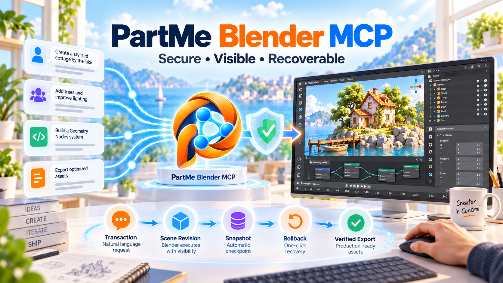

# PartMe Blender MCP

> 一个安全、可见、可恢复的 Blender MCP 运行时：用同一个 Add-on 连接 Codex、Claude、MiniMax Design、Cursor 和其他 MCP 客户端。

<p align="center"></p>

[English](README.md) | [简体中文](README.zh-CN.md) · [安装中心](docs/getting-started/README.zh-CN.md) · [安全](SECURITY.md) · [架构规格](docs/superpowers/specs/2026-09-15-partme-blender-mcp-design.md)


## 项目定位

PartMe Blender MCP 把 MCP 官方 SDK 的 `stdio`、Streamable HTTP 和兼容性 SSE 接入统一转换为经过 Schema、事务、场景版本和路径策略保护的 Blender 操作。它不是文生 3D 模型，也不绑定某个 AI 客户端；它负责让已经连接的客户端可靠地创建、检查、动画化、渲染和导出 Blender 工程。

### 适合谁

- 希望通过自然语言操作 Blender，同时保留前台可见和人工接管的创作者；
- 需要让 Codex、Claude、MiniMax Design 或 Cursor 共用 Blender 能力的团队；
- 需要结构化工具、回滚、版本化交付和审计边界的自动化工程师。

### 解决什么问题

| 问题 | PartMe Blender MCP | 可验证入口 |
|:---|:---|:---|
| 客户端各自安装不同 Blender 插件 | 一个中性 Add-on + 标准 MCP Runtime | `partme_blender` |
| 任意 Python 难以审计 | 164 条闭合结构化 Blender 命令；不暴露专家 Python | `blender_capability_list` |
| 人工编辑可能被覆盖 | `sceneRevision`、事务和接管失效机制 | `blender_connection_status` |
| 导出失败后状态不清楚 | 快照、回滚、任务恢复和回执 | `blender_job_status` |
| 初次安装复杂 | 平台和客户端独立图文教程 | [安装中心](docs/getting-started/README.zh-CN.md) |

## 一眼看懂

```text
本机智能体 · 局域网工作站 · 平板 · 兼容 MCP 客户端
                         │  MCP 官方 Python SDK
                         │  stdio / Streamable HTTP / SSE
                         ▼
┌────────────────────────────────────────────────────────┐
│ PartMe Blender MCP                                     │
│ ① MCP 生命周期与分页工具目录                           │
│ ② 私有会话令牌、闭合 Schema、事务和 sceneRevision     │
│ ③ Blender 主线程执行、暂停/接管、快照与恢复            │
│ ④ 模型、动画、渲染、合成、视频与可验证导出             │
└────────────────────────────────────────────────────────┘
                         │ 私有 UDS / Named Pipe
                         ▼
                前台 Blender + PartMe MCP Add-on
```


## 视觉概览

横向封面展示从 Prompt、Code、Assets 和 MCP 工具调用到可编辑 Blender 场景的完整路径；
方形内容图进一步拆解场景检查、建模、材质、动画和渲染的编排闭环。它们用于说明产品工作流，
不替代后文的运行时、安全和兼容性验证证据。


安全与恢复组图重点呈现中立客户端汇聚、受保护的前台 Blender 执行、快照、回滚、人工接管
和可验证导出。




| 项目属性 | 值 |
|:---|:---|
| 产品 | PartMe Blender MCP |
| MCP Server ID | `partme_blender` |
| 当前版本 | `0.5.0` 正式版 |
| MCP 协议 | `2025-06-18` |
| Harness 兼容协议 | `codex-blender/v1` |
| Blender | 4.2–5.2，按真实验证矩阵声明 |
| Python | 3.11–3.13 |
| 公开传输 | 官方 SDK stdio、Streamable HTTP、兼容性 SSE |
| Blender 私有桥接 | macOS UDS / Windows Named Pipe / loopback TCP fallback |
| 许可证 | Apache-2.0 |

## 核心能力与边界

### 已实现

| 领域 | 能力 | 状态 |
|:---|:---|:---|
| 场景与建模 | 对象、集合、网格、曲线、修改器、硬表面配方 | 从上游 Harness 迁移，待新仓库真实 Blender 回归 |
| UV 与外观 | UV、PBR 材质、贴图、Geometry Nodes、烘焙 | 同上 |
| 角色与动画 | 骨架、蒙皮、约束、IK/FK、Action、F-Curve、NLA、形态键 | 同上 |
| 镜头与渲染 | 相机路径、手持响应、Eevee/Cycles、passes、合成 | 同上 |
| 模拟与编辑器 | 刚体、布料、软体、烟雾、Grease Pencil、Tracking、VSE | 同上 |
| 质量与交付 | 几何/动作/镜头检查、快照、后台任务、多格式导出 | 同上 |
| MCP | 官方 SDK initialize、分页 tools/list、tools/call、structuredContent；HTTP/SSE 独立生命周期 | 自动化传输契约覆盖 |

### 不负责

- 不生成故事、剧本或跨镜头制片计划；
- 不捆绑 Rodin、混元、即梦、Sketchfab 等供应商服务；
- 不静默下载 Blender、扩展、模型或素材；
- 不把连接成功等同于作品质量通过；
- 不把未完成真实客户端/平台验证的组合标为生产可用。

## 安装

### 1. 下载并安装 Blender

从 [Blender 官网](https://www.blender.org/download/)下载。打开一次并确认默认场景正常。

### 2. 下载 Release

从 [v0.5.0](https://github.com/full-aigc-plugins/blender-mcp/releases/tag/v0.5.0)下载：

```text
partme-blender-mcp-addon-0.5.0.zip
partme-blender-mcp-runtime-0.5.0.zip
SHA256SUMS.txt
```

先校验 SHA-256，再安装。

### 3. 安装 Runtime

普通用户下载对应平台包，解压后双击安装器：

- macOS：`install_partme_blender_mcp.command`
- Windows：`install_partme_blender_mcp.bat`

也可以直接用 pip 安装 Runtime 或平台包：

```bash
python -m pip install ./partme-blender-mcp-runtime-0.5.0.zip
python -m partme_blender_mcp --help
```

### 4. 安装 Blender Add-on

1. Blender → **Edit → Preferences → Add-ons**。
2. 右上角菜单 → **从磁盘安装…**。
3. 选择 `partme-blender-mcp-addon-0.5.0.zip`，不要解压。
4. 启用 **PartMe Blender MCP**。
5. 回到 3D View，按 `N`，打开 **PartMe MCP**。
6. 选择授权目录，点击 **Start MCP Server**。


### 5. 配置客户端

| 客户端 | 手册 |
|:---|:---|
| Codex | [codex.zh-CN.md](docs/getting-started/codex.zh-CN.md) |
| Claude Desktop | [claude-desktop.zh-CN.md](docs/getting-started/claude-desktop.zh-CN.md) |
| Claude Code | [claude-code.zh-CN.md](docs/getting-started/claude-code.zh-CN.md) |
| MiniMax Design | [minimax-design.zh-CN.md](docs/getting-started/minimax-design.zh-CN.md) |
| Cursor | [cursor.zh-CN.md](docs/getting-started/cursor.zh-CN.md) |
| 通用 MCP | [generic-mcp.zh-CN.md](docs/getting-started/generic-mcp.zh-CN.md) |
| macOS | [macos.zh-CN.md](docs/getting-started/macos.zh-CN.md) |
| Windows | [windows.zh-CN.md](docs/getting-started/windows.zh-CN.md) |

## 快速开始

配置示例：

```json
{
  "mcpServers": {
    "partme_blender": {
      "command": "python",
      "args": ["-m", "partme_blender_mcp"]
    }
  }
}
```

跨机器使用时，可以在 Blender 的`接入`Tab 配置，也可以显式启动一个监听器。令牌通过环境变量传递，不进入进程命令行：

```bash
PARTME_BLENDER_REMOTE_TOKEN='<不透明令牌>' \
python -m partme_blender_mcp serve-remote streamable-http \
  --host 0.0.0.0 --port 9877 \
  --public-url https://studio.example/mcp \
  --issuer-url https://auth.example/
```

只有旧客户端才使用 `serve-remote sse --port 9878`。非 loopback 监听必须同时配置 Bearer Token、OAuth Issuer 和 HTTPS 公开地址；HTTP 与 SSE 是两个相互独立的进程和开关。

新建客户端对话，先执行：

```text
调用 blender_connection_status。
连接成功后调用 blender_scene_inspect，只读列出当前场景。
```

通过后再要求创建对象。修改类工具需要事务；危险操作首次调用会被拒绝并出现在 Blender 的待批准列表，用户点击 **批准一次** 后，客户端才能用同一 request ID 重试。

## 安全、事务与恢复

- 描述符拒绝符号链接和宽松权限；token 不进入 MCP 回执。
- macOS 使用私有 Unix Domain Socket；Windows 使用当前用户 Named Pipe。
- 修改命令携带最新 `sceneRevision`，防止覆盖人工操作。
- 一个 Blender 默认只有一个主动写入客户端。
- Pause/Take Over/Revoke 会使旧事务和授权失效。
- 删除、覆盖、专家 Python 和受门禁的最终导出先返回 `AUTHORIZATION_REQUIRED`；授权只能由 Blender 本地 UI 对具体 request ID 批准一次，批准值不会发给客户端。
- `annotations` 仅是客户端提示，Harness 才是权限事实源。

漏洞请使用 [GitHub Security Advisories](https://github.com/full-aigc-plugins/blender-mcp/security/advisories/new) 私下报告。

## 错误与排查

| 错误 | 含义 | 处理 |
|:---|:---|:---|
| `BLENDER_NOT_CONNECTED` | 没有活动 Harness | 在 N 面板点击 Start MCP Server |
| `AMBIGUOUS_SESSION` | 多个 Blender 会话 | 明确绑定目标窗口 |
| `STALE_SCENE_REVISION` | 场景已变化 | 重新检查并开启新事务 |
| `AUTHORIZATION_REQUIRED` | 危险操作等待本地决定 | 在 Blender 查看命令并选择“批准一次”或“拒绝”；客户端不能自行声称已确认 |
| 工具列表不完整 | 未读取全部分页 | 跟随 `nextCursor` |

## 开发、测试与发布

```bash
python -m unittest discover -s tests
python scripts/package_release.py --output dist
git diff --check
```

发布产物包括 Add-on、Runtime、macOS/Windows 包、`runtime-manifest.json`、`SHA256SUMS.txt` 和 `SBOM.spdx.json`。GitHub tag `v*` 触发预发布工作流。

## 项目结构

```text
blender-mcp/
├── src/partme_blender_mcp/     # stdio MCP Runtime 与 Harness
├── addon/partme_blender_mcp/   # Blender Add-on
├── installers/                 # macOS / Windows 用户级安装器
├── scripts/package_release.py  # 可重复发行构建
├── docs/getting-started/       # 八份客户端/平台图文手册
├── assets/brand/               # Logo、Hero、Cover、内容图
└── tests/                      # 文档、协议与发行契约
```

## 兼容与迁移

`0.5.0` 是当前正式版本。Harness 暂时保留 `codex-blender/v1`，使现有 `codex-blender-plugin` 能进行差分迁移；新公共身份、MCP Server ID 和 Add-on 均使用 PartMe。未经验证的客户端保持 `DOCUMENTED_NOT_RUN`。

## 深入文档

- [跨客户端架构设计](docs/superpowers/specs/2026-09-15-partme-blender-mcp-design.md)
- [图文安装中心](docs/getting-started/README.zh-CN.md)
- [历史 v0.1.1 安全审查](docs/verification/security-review-0.1.1.md)
- [历史 v0.1.1 许可证工程分诊](docs/verification/license-compliance-0.1.1.md)
- [历史 v0.1.1 平台安装包验证](docs/verification/platform-package-install-0.1.1.md)
- [品牌资产与生成来源](assets/brand/README.md)

## 贡献与许可证

提交变更时必须附带对应测试和兼容证据，不能扩大默认权限或将供应商功能混入核心。

本项目采用 [Apache-2.0](LICENSE)。
