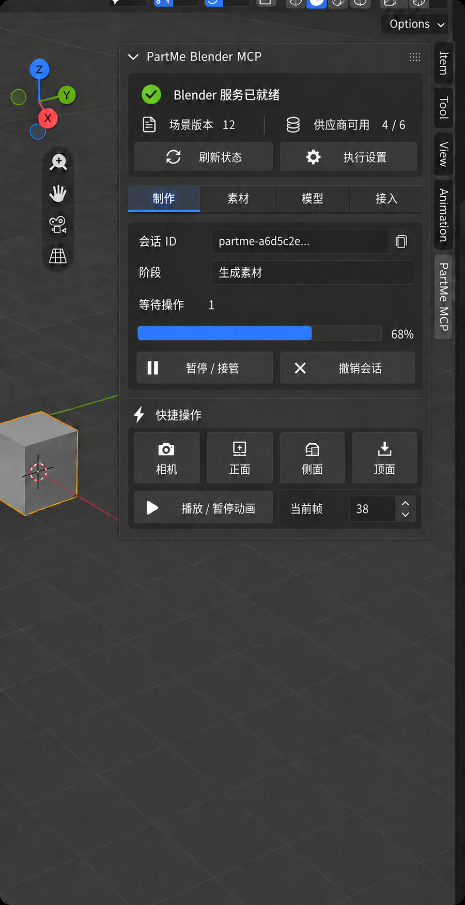
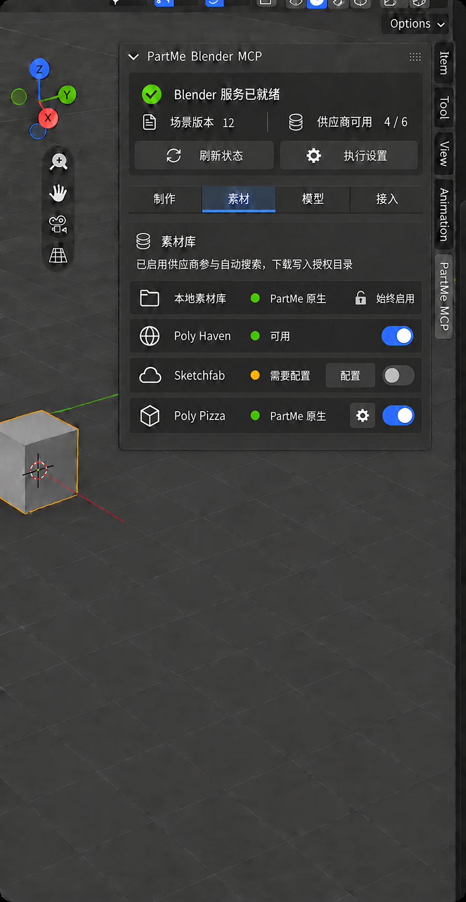
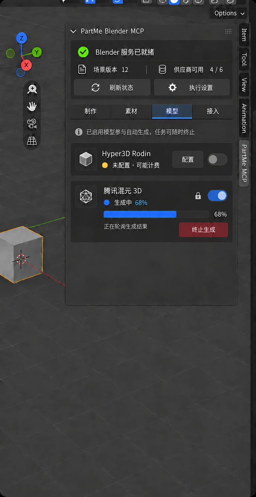
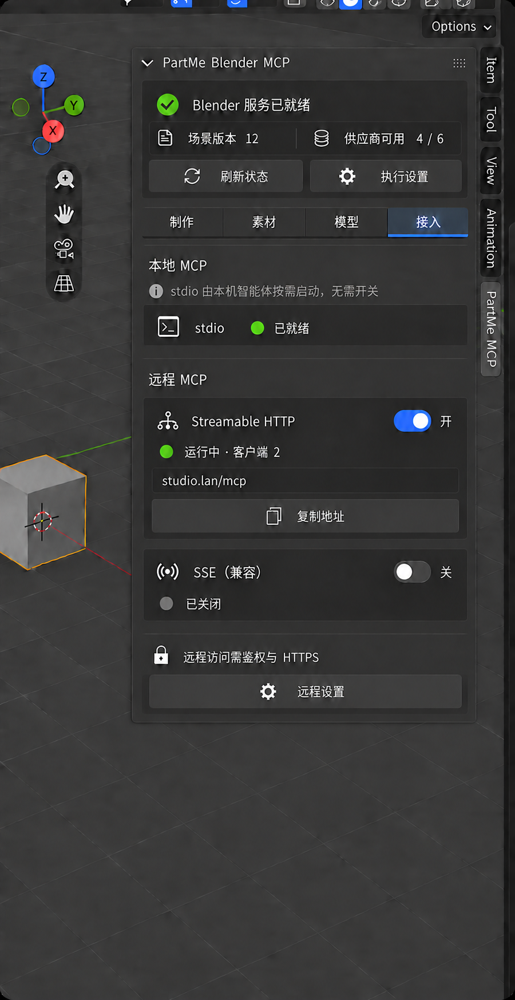
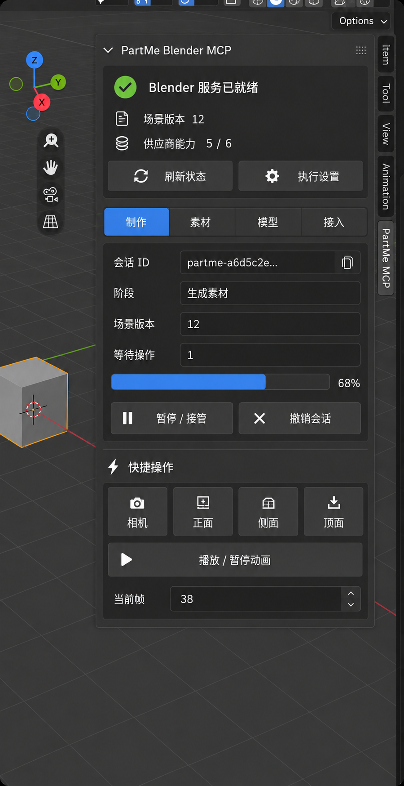
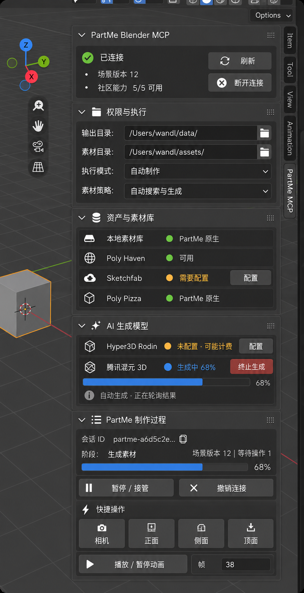
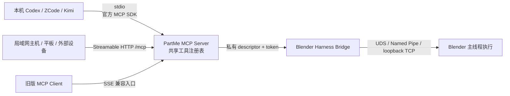
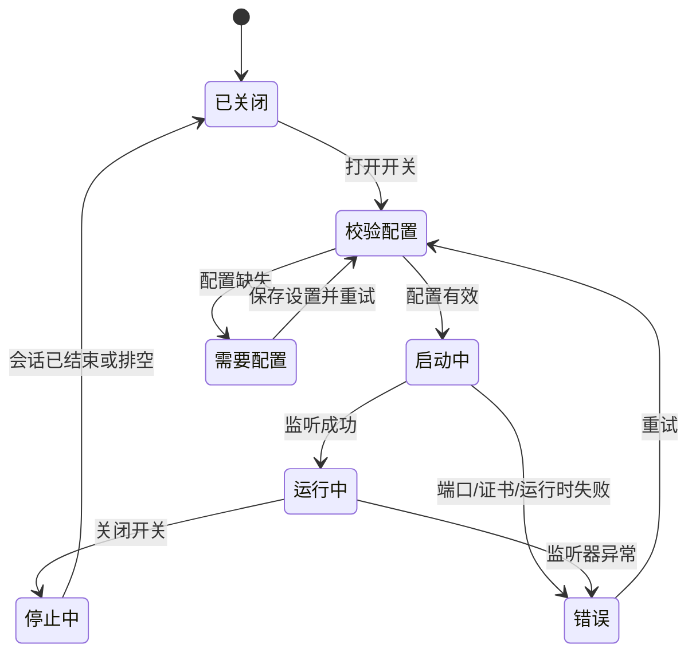
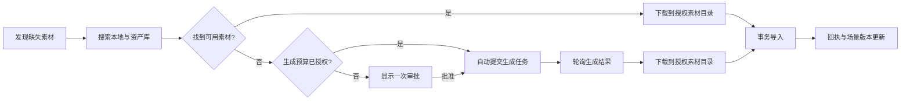

# PartMe Blender MCP 侧栏界面设计（Tab 工作台 V4）

> 状态：Tab 工作台文本概念草图 V4.2 + 四 Tab 视觉精修稿 V4.2 已确认；本地工作台、供应商联动及官方 SDK 三传输已实现，窄宽度可见验收仍待完成
> 初次定稿：2026-09-19
> 多传输修订：2026-09-19
> 适用范围：Blender `PartMe MCP` 侧栏
> 架构规格：[PartMe Blender MCP 供应商整合设计](../superpowers/specs/2026-09-19-provider-integration-design.md)

## 1. 定位

本文档是 PartMe Blender MCP 侧栏的信息架构、交互和视觉基线。供应商协议、风险分类、授权目录和事务导入仍以供应商整合规格为事实源；本文档负责定义这些能力在 Blender 中如何呈现。

核心原则：

- 保持 Blender 原生深色界面，不做 Web 仪表盘式设计；
- MCP 对外传输统一使用 MCP 官方 Python SDK，不维护自写的 MCP JSON-RPC 协议分支；
- 同时支持 `stdio`、Streamable HTTP 和兼容性 SSE，并明确区分本地进程能力与远程监听服务；
- `stdio` 面向本机智能体，由客户端按需启动，不提供 Blender 内开关，只显示真实可用状态；
- Streamable HTTP 和 SSE 面向跨机器访问，必须分别提供开关、监听状态、访问地址与客户端数量；
- 主面板固定显示总览，`场景版本`和`供应商可用`在同一紧凑行展示；内容通过`制作`、`素材`、`模型`、`接入`四个 Tab 切换，默认进入`制作`，`接入`不默认显示；
- `权限与执行`属于低频配置，通过顶部`执行设置`按钮打开弹窗，不再长期占用侧栏高度；
- 素材缺失时默认自动搜索与生成，已授权预算内不中断制作；
- 本地素材库始终启用；外部素材库和 AI 模型由用户显式启停，未启用的供应商不得参与自动路由；
- 供应商密钥只在定向安全配置界面维护，不在主侧栏、`.blend`、Scene 属性、状态快照或回执中明文出现；
- 生成任务必须可终止，终止生成不等于暂停整个会话；
- 保留暂停/接管、撤销会话、相机视角、播放和帧定位等原有快捷操作；
- 审批卡片只在真实越权、未授权付费或超出预算时出现，不占用正常自动制作状态的界面空间。

## 2. 视觉稿

### 2.1 V4.2 四 Tab 视觉精修稿（当前候选）

四张稿共享同一总览区、Tab 尺寸、侧栏宽度和 Blender 原生视觉密度。首次进入默认显示`制作`；切换 Tab 只替换工作区内容，不启动、停止或取消任务。

#### 2.1.1 制作



展示会话阶段、制作总进度、暂停/接管、撤销会话与原有快捷操作。该页是默认 Tab。

#### 2.1.2 素材



素材供应商采用可重复的单行结构：`图标｜名称｜状态｜可选动作｜启用开关`。本地素材库是 PartMe 基础能力，只显示`始终启用`；外部供应商显示真实开关。未完成配置的供应商同时显示`配置`和禁用态开关。没有动作的行不显示箭头或其他点击暗示。后续新增素材供应商时继续追加同结构行，不修改总览区和 Tab 导航。

#### 2.1.3 模型



模型供应商同样使用可重复卡片。未配置时显示`配置`和不可用的关闭开关；配置有效后才允许启用。生成中状态增加任务进度、轮询阶段和独立的`终止生成`动作，并锁定启用开关，防止以关闭开关替代任务取消。终止生成不等同于暂停制作会话。

#### 2.1.4 接入



`本地 MCP`标题下统一说明`stdio 由本机智能体按需启动，无需开关`，stdio 卡片本身只用单行显示名称和可用状态。Streamable HTTP 与 SSE 分别提供独立开关；远程传输按名称、状态、客户端数量、地址和主要动作纵向排布，避免窄侧栏内的信息拥挤。

V4.2 保留 V4 的单工作台和四 Tab 信息架构，以及 V4.1 恢复的 Blender 原生视觉密度。默认仍选中`制作`，`接入`不默认展开。本次修订重点补回社区插件已有的供应商启停能力，并明确配置缺失和任务运行中的开关边界；`制作`与`接入`视觉稿沿用 V4.1。

这组图是后续真实 Blender 实现和截图比对的当前视觉候选基线。静态图只定义正常状态下的布局与视觉优先级；错误、密钥缺失、审批和窄宽度状态仍以本文交互契约与真实 Blender 验收为准。

图片信息：

| Tab | 尺寸 | SHA-256 | 仓库路径 |
|---|---:|---|---|
| 制作 | `900 × 1748` | `d980dc5bcf2b45ec2f1fbe2eabcbe52c3986744268db443e4684a8eeacf8c252` | `docs/assets/design/partme-blender-mcp-sidebar-ui-v4-work-v3.png` |
| 素材 | `901 × 1746` | `ba91d798beef74aabde322348a11c29b2f1a06affd127c149fea970ea6a6ad55` | `docs/assets/design/partme-blender-mcp-sidebar-ui-v4-assets-v5.png` |
| 模型 | `901 × 1746` | `005fbb6c407b263975a459bd3f849e4815e7528deacb059b9f01ffdec44e887a` | `docs/assets/design/partme-blender-mcp-sidebar-ui-v4-models-v4.png` |
| 接入 | `900 × 1747` | `56b4ef66ad3086428c15b4648ee1df9deeba39219c035a5e4478d3ad51cf0447` | `docs/assets/design/partme-blender-mcp-sidebar-ui-v4-access-v4.png` |

### 2.2 V4 初版视觉稿（保留作反例）



该图验证了单工作台和 Tab 架构，但不再作为视觉实现基线。其字号、图标、按钮、字段和卡片尺寸偏大，蓝色选中 Tab 过于醒目，整体更接近 Web 仪表盘而非 Blender 原生侧栏。实现时禁止沿用这些尺寸和强调方式。

图片信息：

- 尺寸：`900 × 1748`
- SHA-256：`13ecefe0b698a8f804d32b9614d40afd12b0231cbb37d676e12143e2159c9f11`
- 仓库路径：`docs/assets/design/partme-blender-mcp-sidebar-ui-v4.png`

### 2.3 历史视觉参考图



该图片继续作为 Blender 深色配色、紧凑密度、卡片层级、状态色和快捷操作质感的参考，但不再作为信息架构基线。真实 Blender 截图已经暴露出标签不够靠左、AI 任务卡片过度拥挤、制作状态被侧栏裁切三个问题，因此内容组织以 V4 文本草图为准，视觉密度以 V4.1 精修稿为准。

图片信息：

- 尺寸：`900 × 1748`
- SHA-256：`146fe423a9edb9e6c9bc599b7399476cc8216041c318fa0a24b8aabf90aeaf26`
- 仓库路径：`docs/assets/design/partme-blender-mcp-sidebar-ui-v1.png`

## 3. 文本概念草图 V4.2

```text
┌─────────────────────────────────┐
│ ▼ PartMe Blender MCP            │
│                                 │
│  ● Blender 服务已就绪           │
│  场景版本 12  │ 供应商可用 4/6  │
│                                 │
│  [  刷新状态  ] [  执行设置  ]  │
│                                 │
│  [制作] [素材] [模型] [接入]    │  原生 Tab
│  ─────────────────────────────  │
│                                 │
│  制作                           │  默认 Tab
│                                 │
│  会话 ID                        │
│  partme-a6d5c2e...       [复制] │
│                                 │
│  阶段  生成素材                 │
│  等待操作  1                    │
│  █████████████░░░  68%          │
│                                 │
│  [暂停 / 接管]   [撤销会话]     │
│                                 │
│  快捷操作                       │
│  [相机] [正面] [侧面] [顶面]    │
│  [播放 / 暂停动画]              │
│  当前帧  [38]                   │
└─────────────────────────────────┘

切换到“素材”：

┌─────────────────────────────────┐
│  [制作] [素材] [模型] [接入]    │
│  ─────────────────────────────  │
│  素材库                         │
│  已启用供应商参与自动搜索       │
│  下载仅写入授权目录             │
│                                 │
│  ▣ 本地素材库 ● PartMe 原生 🔒始终启用│
│  ◎ Poly Haven ● 可用       [● 开]│
│  ☁ Sketchfab ● 需要配置 [配置][○ 关]│
│  ◇ Poly Pizza ● PartMe 原生 [⚙][● 开]│
└─────────────────────────────────┘

切换到“模型”：

┌─────────────────────────────────┐
│  [制作] [素材] [模型] [接入]    │
│  ─────────────────────────────  │
│  AI 生成模型                    │
│  已启用模型参与自动生成         │
│                                 │
│  ◇ Hyper3D Rodin               │
│  ● 未配置 · 可能计费 [配置][○ 关]│
│                                 │
│  ◇ 腾讯混元 3D                 │
│  ● 生成中 68%          🔒[● 开] │
│  █████████████░░░  68%          │
│  正在轮询生成结果               │
│  [         终止生成         ]   │
└─────────────────────────────────┘

切换到“接入”：

┌─────────────────────────────────┐
│  [制作] [素材] [模型] [接入]    │
│  ─────────────────────────────  │
│  本地 MCP                       │
│  ⓘ stdio 由本机智能体按需启动， │
│    无需开关                     │
│                                 │
│  终端  stdio          ● 已就绪  │
│                                 │
│  远程 MCP                       │
│                                 │
│  Streamable HTTP        [● 开]  │
│  ● 运行中 · 客户端 2            │
│  studio.lan/mcp                 │
│  [         复制地址         ]   │
│                                 │
│  SSE（兼容）            [○ 关]  │
│  ○ 已关闭                       │
│                                 │
│  🔒 Bearer Token        ● 已配置│
│  [配置 Token]      [重新生成]   │
│  ⓘ 地址不含 Token；轮换前须关闭 │
│    HTTP/SSE                     │
│  [       完整远程设置       ]   │
└─────────────────────────────────┘

点击“执行设置”弹窗：

┌─────────────────────────────────┐
│ 权限与执行                      │
│                                 │
│ 输出目录                        │
│ [/Users/wandl/data/        📁]  │
│                                 │
│ 素材目录                        │
│ [/Users/wandl/assets/      📁]  │
│                                 │
│ 执行模式                        │
│ [自动制作                    ▾] │
│                                 │
│ 素材策略                        │
│ [自动搜索与生成              ▾] │
│                                 │
│ [取消]           [保存并应用]   │
└─────────────────────────────────┘
```

## 4. Tab 与布局规则

首次安装或没有已保存 UI 状态时：

1. 只注册并展开一个`PartMe Blender MCP`工作台面板；
2. 默认选中`制作`Tab；
3. `素材`、`模型`和`接入`内容不同时绘制；
4. `执行设置`弹窗默认关闭；
5. 紧急状态通过总览下方的短提醒条暴露，不要求用户逐个 Tab 查找。

Tab 使用 Blender 原生`UILayout.prop_tabs_enum()`绘制，绑定到`WindowManager`上的 EnumProperty，例如`partme_blender_ui_tab`。Tab 选择属于临时界面状态，不写入`.blend`和 Scene 自定义属性。四个枚举值为：

- `WORK`：制作，默认值；
- `ASSETS`：素材；
- `MODELS`：模型；
- `ACCESS`：接入。

旧的`权限与执行`、`资产与素材库`、`AI 生成模型`和`PartMe 制作过程`子面板不再同时注册为可展开区域；对应内容由工作台面板按当前 Tab 调用共享 renderer。`MCP 接入`也不再依赖`DEFAULT_CLOSED`，因为默认 Tab 是`制作`。

窄宽度下遵循以下规则：

- 以 Blender N 面板常见的 `240–320 px` 可用宽度为第一设计目标，不依赖用户手动拉宽侧栏；
- 总览与 Tab 导航固定在顶部，只绘制当前 Tab 的内容；切换 Tab 不启动、停止或取消任何任务；
- 总览中的`场景版本`和`供应商可用`使用同一行的左右短指标组；两组都必须完整显示，窄宽度不足时降低装饰间距，不截断文字；
- 四个 Tab 使用两个汉字的短标签，不添加长说明和动态数字，确保`240 px`宽度下仍可完整显示；
- 所有字段标题使用独立的 `label` 行并左对齐，字段控件放在下一行；不再使用会让标题形成右对齐标签列的全局 `use_property_split`；
- 普通表单和任务卡片单行最多承载两个短元素，例如`传输名称 + 开关`或两个短按钮；名称、状态、进度、阶段和动作禁止同时挤在一行；
- 每种 MCP 传输独占一个卡片，不把传输名称、长地址、状态、客户端数量和开关强塞进同一行；
- 传输卡片第一行只放传输名称和开关，后续各行依次显示状态、客户端数量、地址和主要动作；
- `stdio` 不显示开关；Streamable HTTP 与 SSE 各自显示独立开关，任何一个开关都不能代替另一个；
- 远程传输关闭时隐藏访问地址和客户端数量，只显示 `已关闭`；需要配置或启动失败时，在卡片内显示一个主要恢复动作；
- 访问地址独占一行并允许中间截断，`复制地址`使用下一行全宽按钮；只复制公开端点，不复制令牌、密钥或其他凭证；
- 素材供应商没有进度、阶段或二级详情时使用单行状态行：`图标｜名称｜状态｜可选动作｜启用开关`；本地素材库以`始终启用`替代开关；无动作时不显示箭头、空按钮或点击暗示；
- 素材供应商的短动作（如`配置`）和开关可以放在行尾；窄到无法完整显示时优先隐藏装饰图标、压缩间距，再将`配置`移到下一行，禁止截断名称和状态；
- AI 模型供应商按`名称 → 状态 → 进度/阶段 → 动作`纵向排列；无进度时省略进度行；
- AI 模型供应商的启用开关放在卡片首行右侧；配置无效时开关禁用，任务运行中开关锁定；
- AI 模型的`终止生成`等高风险动作使用独立按钮，不与状态文字共用拥挤的一行；
- 长路径使用 Blender 路径输入框并允许截断，不拉宽侧栏；
- 状态不能只依赖颜色，必须同时显示文字；
- 会话 ID、阶段和等待操作各自独占一行；场景版本只在顶部总览显示一次，不在制作 Tab 重复；
- 相机、正面、侧面、顶面四个按钮等宽排列；
- 播放/暂停独占一行，当前帧独占下一行；
- 生成进度放在`模型`Tab，制作总进度放在`制作`Tab，两者语义不同；
- 若隐藏 Tab 内出现待审批、生成完成、生成失败或接入错误，总览下方显示一条最高优先级提醒，并提供`查看`按钮切换到对应 Tab。

### 4.1 当前截图问题闭环

| 编号 | 当前问题 | V4 设计处理 | 实现验收方式 |
|---|---|---|---|
| 1 | 权限字段标题视觉上居中/右靠 | 移入`执行设置`弹窗，标题与控件分行并左对齐 | `240 px`弹窗内容中四个标题左边缘一致 |
| 2 | AI 供应商名称、状态、按钮、进度和阶段挤在卡片内 | 模型独占一个 Tab，卡片按名称、状态、进度、阶段、动作纵向排列 | 名称、状态、进度、阶段、按钮均完整且没有省略号冲突 |
| 3 | 制作 Tab 重复显示场景版本，且与等待操作同行后被遮挡 | 场景版本只保留在顶部总览，制作 Tab 仅显示等待操作 | 最窄宽度下只出现一个场景版本，等待操作完整可见 |

连接区不再显示全局`断开连接`。Streamable HTTP 与 SSE 的开关只管理各自监听服务；制作会话的权限回收保留在`制作`Tab 中，并命名为`撤销会话`，避免与停止网络监听混淆。

顶部总体状态表达的是 Blender Harness 和共享 MCP 服务是否可工作，而不是某一个客户端是否“已连接”。当总体状态不可用时，`stdio`显示`不可用`，远程开关禁用并显示共同原因；多个客户端同时存在时仍只显示一个总体状态，客户端数量放到各传输卡片内。

## 5. MCP 传输与远程访问

### 5.1 当前事实与目标边界

| 维度 | 当前实现（`0.5.0`） | 本设计目标 |
|---|---|---|
| MCP 协议实现 | MCP 官方 Python SDK `2.2.x` 低层 Server | 统一使用 MCP 官方 Python SDK |
| 本机接入 | 官方 SDK `stdio_server()` | `stdio`，由本机 MCP Host 按需拉起 |
| 远程接入 | 官方 Streamable HTTP；官方 SSE 兼容组件 | 优先 Streamable HTTP，同时保留 SSE 兼容入口 |
| 工具注册 | 三种传输共享 `build_official_server()` 与同一适配器目录 | 三种传输共享同一份工具注册表、Schema、分页和错误语义 |
| Blender 内部桥接 | macOS 使用 UDS、Windows 使用 Named Pipe，其他平台使用 loopback TCP | 继续作为私有 Harness 通道，不对用户宣称为 MCP HTTP/SSE |

UDS、Named Pipe 和 loopback TCP 是 MCP Server 到 Blender Harness 的内部控制通道；`stdio`、Streamable HTTP 和 SSE 才是 MCP Host/Client 连接 MCP Server 的公开传输。两层协议、端点和凭证必须隔离。



### 5.2 三种传输的界面和行为

| 传输 | 使用场景 | 界面控制 | 状态 | 默认端点/说明 |
|---|---|---|---|---|
| `stdio` | 本机智能体、本地命令 | 无开关，只读状态 | `不可用`、`已就绪` | 不监听端口；由 MCP Host 启动子进程；活动客户端作为次级数量信息 |
| Streamable HTTP | 局域网、远程工作站、平板和内网穿透 | 独立开关 | `已关闭`、`需要配置`、`启动中`、`运行中`、`错误` | 首选远程传输，默认路由 `/mcp` |
| SSE | 仍只支持旧 SSE 的客户端 | 独立开关并标注 `兼容` | `已关闭`、`需要配置`、`启动中`、`运行中`、`错误` | 兼容入口，如 `/sse` 与消息提交路由 |

首次安装时，Streamable HTTP 与 SSE 均默认关闭；`stdio`只做就绪探测。用户如需 Blender 启动后自动恢复远程监听，必须在远程设置中显式启用自动启动，并且配置已通过鉴权、绑定地址和 TLS 规则校验。

状态语义：

- `stdio · 不可用`：官方 SDK 运行时、服务入口或 Blender 私有桥接未就绪；必须显示具体原因和恢复提示；
- `stdio · 已就绪`：本地 MCP Host 可以启动服务；如存在活动的本地会话，在次级文字中显示客户端数量或名称，但主状态仍为`已就绪`；
- `Streamable HTTP/SSE · 已关闭`：监听器未启动，不表示 Blender 服务异常；
- `Streamable HTTP/SSE · 运行中`：展示可访问地址和当前客户端数量；地址来自实际监听/公开地址配置，不能硬编码；
- `需要配置`：缺少绑定地址、鉴权或 TLS/公开地址等必要配置，打开开关时应停在该状态而非静默失败。

### 5.3 开关与会话边界

- 打开 Streamable HTTP 或 SSE 时，先校验监听地址、鉴权与 TLS 条件，再异步启动对应监听器；启动过程显示 `启动中`，不得阻塞 Blender UI 主线程；
- 关闭某一远程传输时，只停止该监听器接收新连接，并按服务端策略结束或排空其活动会话；不得停止另一种传输、`stdio`、Blender Harness 或当前制作任务；
- `刷新`只重新读取 SDK 运行时、监听器、端点和客户端状态，不隐式启动任何传输；
- `撤销会话`只撤销当前 PartMe 制作会话及其授权，不等同于关闭 HTTP/SSE 监听器；
- 所有传输进入同一工具调度、风险分级、审批、授权目录、事务导入和回执链路，远程接入不能绕过任何安全规则。

远程监听状态机：



### 5.4 远程设置

`远程设置`打开独立的 Blender 配置区或弹窗，至少包含：

- 作用范围：`仅本机`、`局域网`、`自定义`；默认 `仅本机`；
- 绑定主机与端口；Streamable HTTP 与 SSE 可以共享 Web Server，但路由和开关必须独立；
- 对外访问地址：用于反向代理、域名或内网穿透后的可复制地址，不参与本地绑定；
- Streamable HTTP 路由、SSE 事件路由与消息提交路由；
- 鉴权状态、授权服务器/令牌校验配置和当前 TLS 状态；
- Bearer Token 的密码输入、强随机生成与轮换；主面板只显示`已配置/未配置`，不显示明文；
- `测试配置`、`保存并启动`，以及不会泄露凭证的错误摘要。
- 可选的`Blender 启动时自动开启`；默认关闭，只能在当前远程配置验证成功后启用。

配置字段应进入 Add-on Preferences 或受保护的本地配置，不写入 `.blend`、Scene 自定义属性、公开 URL、日志或回执。界面复制公开端点时绝不附带 Token。用户可粘贴自定义 Token，也可生成强随机 Token；生成动作只在当次操作后将新 Token 复制到系统剪贴板用于配置客户端，不提供常驻的“显示/复制现有 Token”入口。轮换前必须停止 HTTP 与 SSE，避免已连接客户端在不知情时失效。

### 5.5 安全基线

- Streamable HTTP 与 SSE 作为 HTTP 服务时，使用官方 SDK 的授权扩展实现 OAuth 2.1 资源服务器能力；令牌校验使用 `TokenVerifier`，资源服务器元数据和授权设置使用 `AuthSettings`；
- 非 loopback 绑定必须启用鉴权；对公网或经内网穿透暴露时还必须使用 HTTPS，不允许提供“裸 `0.0.0.0` + 无鉴权”的快捷模式；
- `stdio`不套用 HTTP Authorization，它的安全边界是本机进程启动权限、客户端配置和私有桥接令牌；
- 外部 MCP 凭证与 Blender Harness 私有 descriptor/token 不是同一种凭证，禁止复用、透传或展示；
- 每个远程客户端拥有独立会话标识、审计记录和撤销能力，但共享相同的场景版本与并发冲突检查；
- 平板或外部设备只是远程 MCP Client，不直接访问 Blender 内部桥接地址。

### 5.6 实现约束

- 以 MCP 官方 Python SDK v2 的稳定 API 为目标，并在依赖文件中设置明确版本范围；升级 SDK 时必须重新跑传输契约测试；
- 只维护一个工具注册入口，禁止为 `stdio`、Streamable HTTP 和 SSE 复制三份工具定义；
- 初始化、能力协商、工具 Schema、分页、协议错误和传输生命周期交给官方 SDK；PartMe 只实现领域工具、鉴权策略和 Blender 桥接；
- 建立独立的 `TransportManager`（名称可调整）统一维护传输快照，Blender 面板只读取快照和提交启停命令，不直接在 `draw()` 中运行网络服务器；
- 三种传输返回同一回执结构，并携带可追踪的会话、调用、场景版本和 producer 信息。

官方实现依据：

- [MCP Python SDK](https://github.com/modelcontextprotocol/python-sdk)
- [运行 MCP Server：stdio、Streamable HTTP 与 SSE](https://github.com/modelcontextprotocol/python-sdk/blob/main/docs/run/index.md)
- [HTTP 授权与 OAuth 2.1 资源服务器](https://github.com/modelcontextprotocol/python-sdk/blob/main/docs/run/authorization.md)

## 6. 自动生成与终止

自动制作模式下，素材处理默认按以下顺序运行：



生成任务状态至少包括：

`idle → submitting → generating → downloading → staged → importing → completed`

终止或异常分支：

- `cancelled`：用户主动终止；
- `failed`：供应商、网络、下载或校验失败；
- `approval_required`：缺少付费授权或超出预算。

传输、生成和制作会话的停止动作不可混用：

| 动作 | 作用范围 | 预期行为 |
|---|---|---|
| `终止生成` | 当前生成任务 | 停止轮询、下载和后续导入；供应商支持时同时取消远端任务 |
| `暂停 / 接管` | 当前制作会话 | 暂停自动命令队列，用户接管 Blender 场景 |
| 关闭 `Streamable HTTP` | HTTP 监听服务 | 停止 HTTP 新连接并结束或排空该传输的客户端，不影响 SSE、stdio 和制作任务 |
| 关闭 `SSE` | SSE 兼容监听服务 | 停止 SSE 新连接并结束或排空该传输的客户端，不影响 HTTP、stdio 和制作任务 |
| `撤销会话` | 当前 PartMe 制作会话 | 撤销会话授权并关闭该会话，不停止任何 MCP 监听器 |

如果供应商不支持远端取消，按钮需要明确反馈“已停止等待，远端任务可能仍在运行”，不能把本地停止轮询宣称为远端任务已取消。

### 6.1 供应商启用、配置与任务边界

供应商注册表必须把`用户是否启用`与`运行状态`分开保存，不能继续用一个`state`字段同时表达偏好和健康状态。建议最小快照为：

```text
provider_id, category, source, enabled, configurable,
state, status_text, actions, active_task, updated_at
```

其中：

- `enabled`是用户持久化偏好，决定供应商是否进入自动搜索、自动生成和显式调用候选集；
- `state`描述当前运行事实，至少包含`ready`、`disabled`、`configuration_required`、`unavailable`、`busy`和`error`；
- 本地素材库属于基础能力，固定`enabled = true`，界面显示`始终启用`且不提供开关；
- Poly Haven、Sketchfab、Poly Pizza、Hyper3D Rodin、腾讯混元 3D 等外部能力均通过同一注册协议声明是否可配置、是否可启停和支持哪些动作；
- `configuration_required`时开关保持关闭且不可操作，用户完成定向配置并校验成功后才可启用；
- `busy`时保持任务开始前的启用值，但开关锁定；用户必须通过`终止生成`进入取消流程，不能直接关闭供应商绕过清理、计费确认、下载和事务状态；
- 关闭供应商只影响后续路由，不删除已下载素材、不撤销已导入对象，也不终止已经运行的任务；
- 配置入口打开对应供应商的定向安全表单。供应商 API Key、Secret 和 Token 不在主面板直接输入，不写入`.blend`、Scene 自定义属性、状态快照、日志、回执或剪贴板；远程 MCP Bearer Token 遵循 5.4 节单独定义的一次性生成交付规则；
- 开关成功后立即刷新单个供应商与顶部聚合数量；失败时回滚到运行时真实值并在卡片内显示可恢复错误。

`供应商可用 x / y`的计算口径为：`x = enabled && state ∈ {ready, busy}`，`y = registered total`。因此已配置但被用户关闭的供应商不计入可用数，生成中的已启用供应商仍计入可用数。

## 7. 面板内容

### 7.1 PartMe Blender MCP 总览

- Blender 服务整体状态；
- 场景版本；
- 供应商可用数量，文案固定为`供应商可用 x / y`；
- `y`是注册表中原生与社区供应商总数，`x = enabled && (ready || busy)`，表示已启用且已就绪或正在执行任务的供应商；
- `disabled`、`configuration_required`、`unavailable`和`error`不计入可用数；该指标不是“能力数量”；
- 刷新状态；
- 隐藏 Tab 中最高优先级的待处理提醒及`查看`动作；
- 不显示具体传输开关、访问地址或含义模糊的全局`断开连接`。

### 7.2 Tab 导航

- 使用 Blender 原生`prop_tabs_enum`；
- 固定顺序为`制作`、`素材`、`模型`、`接入`；
- 默认选中`制作`；
- 每次只绘制一个 Tab 的内容；
- 切换只改变界面视图，不改变任务、会话、传输或授权状态。

### 7.3 制作

- 分行显示会话 ID、阶段和等待操作数，不重复显示顶部已有的场景版本；
- 制作总进度；
- 按需出现的审批卡片；
- 暂停/接管和撤销会话；
- 相机、正面、侧面、顶面；
- 播放/暂停动画和当前帧。

### 7.4 素材

- 本地素材库；
- Poly Haven；
- Sketchfab；
- Poly Pizza PartMe 原生主路径；
- 本地素材库固定启用，不提供关闭开关；
- 外部供应商使用单行状态行：图标、名称、状态、可选动作和启用开关；没有动作时不显示箭头；
- 缺少密钥或必要配置时显示定向`配置`动作，开关保持关闭且禁用。

### 7.5 模型

- Hyper3D Rodin；
- 腾讯混元 3D；
- 配置、可用、生成中、错误等状态；
- 每个模型供应商具有独立启用开关；未配置时不可启用，生成中锁定开关；
- 当前生成进度和阶段；
- 定向配置动作和独立的终止生成动作。

### 7.6 接入

- `本地 MCP`标题下显示`stdio 由本机智能体按需启动，无需开关`，不在状态卡片内重复说明；
- `stdio` 使用单行状态行显示`不可用`或`已就绪`，不显示开关；活动客户端数量作为次级信息；
- Streamable HTTP 的独立开关、监听状态、地址和客户端数量；
- SSE 兼容入口的独立开关、监听状态、地址和客户端数量；
- Bearer Token 的`已配置/未配置`状态、`配置 Token`和`生成/重新生成`动作；
- 复制地址与完整远程设置；
- 每种传输使用独立纵向卡片。

### 7.7 执行设置弹窗

- 输出目录，标题和输入框分行；
- 素材目录，标题和输入框分行；
- 执行模式，标题和选择框分行，默认`自动制作`；
- 素材策略，标题和选择框分行，默认`自动搜索与生成`；
- `取消`和`保存并应用`；
- 弹窗关闭前不修改当前 Session Policy，保存时原子应用。

### 7.8 控件联动契约

视觉控件只有在连接真实状态源和执行动作后才算实现。禁止使用定时假进度、固定状态文字或只修改 Blender 属性却不更新运行时的“演示联动”。

| 控件 | 读取的真实状态 | 用户动作 | 成功反馈 | 失败反馈 |
|---|---|---|---|---|
| Tab 导航 | `WindowManager.partme_blender_ui_tab` | 切换当前内容视图 | 当前页立即重绘，业务状态不变 | Enum 状态无效时回到`制作` |
| `刷新状态` | Harness、传输管理器、供应商注册表 | 执行一次非阻塞刷新 | 总览、传输和供应商状态一起更新 | 保留上次有效值并显示错误摘要 |
| `stdio`状态 | 官方 SDK 可用性、CLI 入口、Harness descriptor | 只读，不可点击启停 | `已就绪`及活动客户端次级信息 | `不可用`及具体原因 |
| HTTP/SSE 开关 | 对应监听器生命周期快照 | 真实启动或停止对应监听器 | 开关、状态、地址和客户端数一致 | 恢复到实际开关状态并显示错误 |
| `复制地址` | 当前监听器公开端点 | 复制不含凭证的 URL | 短暂提示`已复制` | 没有有效端点时禁用 |
| `配置 Token` | Add-on Preferences 中的受保护值 | 在密码输入弹窗中设置或清除 Bearer Token | 状态更新为`已配置/未配置` | HTTP/SSE 运行时拒绝变更并提示先关闭 |
| `生成/重新生成` | HTTP/SSE 生命周期和本地安全随机源 | 生成 32 字节强随机 Token，保存并仅复制一次 | 提示立即粘贴到客户端 | HTTP/SSE 运行时拒绝轮换，旧 Token 保持有效 |
| `远程设置` | Add-on Preferences 中受保护的远程配置 | 打开定向配置界面 | 保存后重新校验传输配置 | 字段旁显示可恢复错误 |
| `保存并应用` | 四个权限与执行字段及当前 Session Policy | 原子更新授权目录和执行策略 | 关闭弹窗并刷新状态 | 保持原策略和弹窗内容，不做部分应用 |
| 供应商`配置` | 对应供应商定义和配置状态 | 打开该供应商的定向设置，不只打开空白 Preferences | 保存后只刷新该供应商 | 保持`需要配置`并显示原因 |
| 供应商启用开关 | 注册表中的`enabled`、配置有效性和活动任务 | 启用或停用后续路由 | 注册表、卡片与顶部可用数量一致 | 回滚到运行时真实值并显示原因 |
| `终止生成` | 当前真实 provider task | 请求取消远端任务并停止本地轮询/下载/导入 | 状态变为`已终止`或`取消中` | 明确远端可能继续，不伪报取消成功 |
| `暂停 / 接管` | 当前制作会话 | 暂停自动命令队列 | Header、制作面板同步显示已暂停 | 显示会话错误，不修改场景 |
| `撤销会话` | 当前制作会话及授权 | 撤销会话，不关闭远程监听器 | 会话状态清空，传输仍按实际状态显示 | 保持原会话并显示错误 |
| 视图、播放、当前帧 | Blender 当前场景和播放状态 | 调用真实 Blender 操作 | UI 跟随 Blender 状态变化 | 保持原状态并显示操作失败 |

## 8. 状态呈现

| 状态 | 颜色倾向 | 必须显示的文字 |
|---|---|---|
| stdio 不可用 | 红色或中性灰 | `不可用`和具体原因/恢复提示 |
| stdio 已就绪 | 绿色 | 状态行显示`已就绪`；本地 MCP 区域说明`stdio 由本机智能体按需启动，无需开关` |
| 远程传输已关闭 | 中性灰 | `已关闭` |
| 远程传输启动/停止中 | 蓝色 | `启动中`或`停止中`，配合活动指示 |
| 远程传输运行中 | 绿色 | `运行中`、客户端数量和可复制地址 |
| 远程传输需要配置 | 琥珀色 | `需要配置`和主要恢复动作 |
| 可用/已配置 | 绿色 | `可用`、`已配置`或`PartMe 原生` |
| 已关闭 | 中性灰 | `已关闭`且开关关闭；不参与自动路由 |
| 配置缺失 | 琥珀色 | `需要配置`或`未配置` |
| 生成中 | 蓝色 | `生成中`、百分比和当前阶段；启用开关显示锁定 |
| 需要审批 | 琥珀色 | 原因、`批准一次`和`拒绝` |
| 错误 | 红色 | 可理解的错误摘要和恢复动作 |
| 已终止 | 中性灰 | `已终止`，以及远端是否实际取消 |

## 9. 实现验收

- [x] 侧栏只显示一个`PartMe Blender MCP`工作台，不再同时堆叠五个子面板；
- [x] 使用 Blender 原生`UILayout.prop_tabs_enum()`实现`制作`、`素材`、`模型`、`接入`四个 Tab；
- [x] 首次默认选中`制作`，`接入`不默认显示；
- [x] Tab 状态保存在`WindowManager`，不写入`.blend`和 Scene 自定义属性；
- [ ] `执行设置`通过独立弹窗打开，并以`保存并应用`原子更新运行时策略；
- [ ] 在`240 px`侧栏宽度下，权限字段标题全部居左且左边缘一致；
- [ ] AI 模型卡片按名称、状态、进度/阶段、动作纵向排列，没有控件相互挤压；
- [ ] 场景版本只在顶部总览出现一次，制作 Tab 的等待操作完整显示且不被遮挡；
- [x] `供应商可用 x / y`由注册表实时计算，其中`x = enabled && (ready || busy)`、`y = registered total`，不使用硬编码或含义不明的“供应商能力”；
- [x] 隐藏 Tab 出现待审批、生成完成/失败或接入错误时，总览显示可跳转提醒；
- [ ] 界面层级、状态色和间距与确认后的 V4 视觉稿一致；
- [x] MCP 协议层统一使用官方 Python SDK，不再保留自写 JSON-RPC 传输分支；
- [x] `stdio`主状态只显示`不可用`或`已就绪`，不提供开关；活动客户端数量仅作为次级信息；
- [x] Streamable HTTP 与 SSE 各自具有独立开关、生命周期、地址与客户端数量；
- [x] Streamable HTTP 明确作为首选远程传输，SSE 明确标注为兼容入口；
- [x] 关闭一种远程传输不会关闭另一种传输、stdio、Blender Harness 或制作任务；
- [x] `撤销会话`与关闭监听器具有不同语义，界面不再出现含义模糊的全局`断开连接`；
- [ ] 非 loopback 监听必须鉴权，对公网或内网穿透暴露必须使用 HTTPS；
- [x] 复制访问地址时不包含 token、密钥或其他凭证；
- [x] 接入页显示 Bearer Token 配置状态，并提供真实的密码配置和强随机生成入口；
- [x] HTTP/SSE 运行时拒绝修改或轮换 Token，生成结果仅在当次操作后复制一次；
- [x] Blender 私有 UDS/Named Pipe/loopback TCP 不被展示为 MCP HTTP/SSE；
- [x] 三种传输共享同一工具注册、风险分级、审批、授权目录、事务导入与回执链路；
- [x] 自动制作模式默认启用自动搜索与生成；
- [x] 本地素材库固定启用且没有多余开关；每个外部素材和模型供应商都有独立、真实的启用偏好；
- [x] 关闭供应商后不会再进入自动路由，但不会删除已有素材、撤销已导入对象或中断活动任务；
- [ ] 配置缺失时供应商开关关闭且禁用，`配置`打开该供应商的定向安全表单；
- [ ] 供应商密钥不在主面板、`.blend`、Scene 属性、状态快照、日志、回执或剪贴板中明文出现；
- [x] 生成中供应商的启用开关锁定，只能通过独立的`终止生成`进入取消流程；
- [x] 生成任务显示来自运行时的真实状态、进度和供应商；
- [x] `配置`、`刷新状态`、供应商开关、传输开关、`复制地址`和`终止生成`均连接真实能力，不是静态控件；
- [x] `终止生成`与`暂停 / 接管`、`撤销会话`具有不同语义；
- [x] 原有相机、视图、播放和帧快捷操作完整保留；
- [ ] 正常自动生成时不显示审批卡片；
- [ ] 缺密钥、超预算、错误和不支持远端取消时提供明确反馈；
- [x] 生成结果只写入授权目录，并通过事务导入和回执闭环；
- [ ] 在真实 Blender 中验证窄宽度、Tab 切换、默认 Tab、设置弹窗和全部关键状态；
- [ ] 以本机 MCP Host 验证 stdio 就绪、活动客户端进入/退出和不可用原因恢复；
- [ ] 以同一局域网的第二台设备验证 Streamable HTTP 的鉴权、并发客户端、重连和关闭开关；
- [ ] 以仍使用旧传输的客户端验证 SSE 兼容入口与独立关闭；
- [ ] 以平板兼容客户端或等价远程设备验证公开地址、HTTPS、审批和场景版本冲突反馈。
