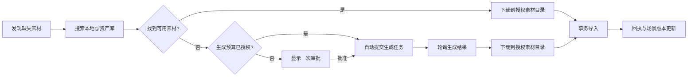

# PartMe Blender MCP 侧栏界面设计 V1

> 状态：已定稿  
> 定稿日期：2026-09-19  
> 适用范围：Blender `PartMe MCP` 侧栏  
> 架构规格：[PartMe Blender MCP 供应商整合设计](../superpowers/specs/2026-09-19-provider-integration-design.md)

## 1. 定位

本文档是 PartMe Blender MCP 侧栏的信息架构、交互和视觉基线。供应商协议、风险分类、授权目录和事务导入仍以供应商整合规格为事实源；本文档负责定义这些能力在 Blender 中如何呈现。

核心原则：

- 保持 Blender 原生深色界面，不做 Web 仪表盘式设计；
- `权限与执行`、`资产与素材库`、`AI 生成模型`、`PartMe 制作过程`首次显示时全部默认展开；
- 素材缺失时默认自动搜索与生成，已授权预算内不中断制作；
- 生成任务必须可终止，终止生成不等于暂停整个会话；
- 保留暂停/接管、撤销连接、相机视角、播放和帧定位等原有快捷操作；
- 审批卡片只在真实越权、未授权付费或超出预算时出现，不占用正常自动制作状态的界面空间。

## 2. 定稿效果图


该图片是已确认的视觉目标，不是实际 Blender 运行验证截图。实现完成后仍须在真实 Blender 中验证窄宽度、展开状态、错误状态、密钥缺失、生成中、终止和审批状态。

图片信息：

- 尺寸：`900 × 1748`
- SHA-256：`146fe423a9edb9e6c9bc599b7399476cc8216041c318fa0a24b8aabf90aeaf26`
- 仓库路径：`docs/assets/design/partme-blender-mcp-sidebar-ui-v1.png`

## 3. 文本概念草图 V1

```text
┌─────────────────────────────────────┐
│ ▼ PartMe Blender MCP                │
│                                     │
│  ● 已连接                           │
│  场景版本 12 · 社区能力 5/5         │
│                       [刷新] [断开]  │
└─────────────────────────────────────┘

┌─────────────────────────────────────┐
│ ▼ 权限与执行                        │  默认展开
│                                     │
│  输出目录  /Users/wandl/data/       │
│  素材目录  /Users/wandl/assets/     │
│  执行模式  自动制作                 │
│  素材策略  自动搜索与生成（默认）   │
│                                     │
│  已授权预算内自动生成；超出预算时   │
│  才请求一次确认。                   │
└─────────────────────────────────────┘

┌─────────────────────────────────────┐
│ ▼ 资产与素材库                      │  默认展开
│                                     │
│  ▣ 本地素材库        ● PartMe 原生  │
│  ◎ Poly Haven        ● 可用         │
│  ☁ Sketchfab         ● 需要配置     │
│  ◇ Poly Pizza        ● PartMe 原生  │
│                                     │
│  搜索、下载默认自动写入授权目录。   │
└─────────────────────────────────────┘

┌─────────────────────────────────────┐
│ ▼ AI 生成模型                       │  默认展开
│                                     │
│  ◇ Hyper3D Rodin     ● 未配置       │
│  ◇ 腾讯混元 3D       ● 生成中       │
│                                     │
│  ┌───────────────────────────────┐  │
│  │ 腾讯混元 3D · 正在生成模型    │  │
│  │ █████████████░░░░░  68%       │  │
│  │ 阶段：轮询生成结果             │  │
│  │                     [终止生成] │  │
│  └───────────────────────────────┘  │
└─────────────────────────────────────┘

┌─────────────────────────────────────┐
│ ▼ PartMe 制作过程                   │  默认展开
│                                     │
│  会话  partme-a6d5c2e...            │
│  阶段  生成素材                     │
│  场景版本 12 · 等待操作 1           │
│                                     │
│  仅在确实需要时显示审批卡片：       │
│  ┌───────────────────────────────┐  │
│  │ 待批准：超出本次生成预算       │  │
│  │               [批准一次][拒绝]│  │
│  └───────────────────────────────┘  │
│                                     │
│  [暂停 / 接管]       [撤销连接]     │
│                                     │
│  快捷操作                           │
│  [相机] [正面] [侧面] [顶面]        │
│  [播放 / 暂停动画]        帧 [38]   │
└─────────────────────────────────────┘
```

## 4. 展开与布局规则

首次安装或没有已保存 UI 状态时：

1. `PartMe Blender MCP` 主面板展开；
2. `权限与执行` 展开；
3. `资产与素材库` 展开；
4. `AI 生成模型` 展开；
5. `PartMe 制作过程` 展开。

用户手动折叠后，可以遵循 Blender 的界面状态记忆。实现不得用 `DEFAULT_CLOSED` 强制关闭上述面板。

窄宽度下遵循以下规则：

- 供应商行最多展示图标、名称、短状态和一个主要动作；
- 长路径使用 Blender 路径输入框并允许截断，不拉宽侧栏；
- 状态不能只依赖颜色，必须同时显示文字；
- 相机、正面、侧面、顶面四个按钮等宽排列；
- 播放/暂停和帧输入单独成行；
- 生成进度放在 `AI 生成模型` 内，制作总进度放在 `PartMe 制作过程` 内，两者语义不同。

## 5. 自动生成与终止

自动制作模式下，素材处理默认按以下顺序运行：



生成任务状态至少包括：

`idle → submitting → generating → downloading → staged → importing → completed`

终止或异常分支：

- `cancelled`：用户主动终止；
- `failed`：供应商、网络、下载或校验失败；
- `approval_required`：缺少付费授权或超出预算。

三个停止动作不可混用：

| 动作 | 作用范围 | 预期行为 |
|---|---|---|
| `终止生成` | 当前生成任务 | 停止轮询、下载和后续导入；供应商支持时同时取消远端任务 |
| `暂停 / 接管` | 当前制作会话 | 暂停自动命令队列，用户接管 Blender 场景 |
| `撤销连接` | MCP 连接 | 关闭会话并撤销当前连接权限 |

如果供应商不支持远端取消，按钮需要明确反馈“已停止等待，远端任务可能仍在运行”，不能把本地停止轮询宣称为远端任务已取消。

## 6. 面板内容

### 6.1 连接状态

- 当前连接状态；
- 场景版本；
- 社区供应商能力可用数量；
- 刷新；
- 断开连接。

### 6.2 权限与执行

- 输出目录；
- 素材目录；
- 执行模式，默认 `自动制作`；
- 素材策略，默认 `自动搜索与生成`。

### 6.3 资产与素材库

- 本地素材库；
- Poly Haven；
- Sketchfab；
- Poly Pizza PartMe 原生主路径。

### 6.4 AI 生成模型

- Hyper3D Rodin；
- 腾讯混元 3D；
- 配置、可用、生成中、错误等状态；
- 当前生成进度；
- 终止生成。

### 6.5 PartMe 制作过程

- 会话 ID、阶段、场景版本和等待操作数；
- 制作总进度；
- 按需出现的审批卡片；
- 暂停/接管和撤销连接；
- 相机、正面、侧面、顶面；
- 播放/暂停动画和当前帧。

## 7. 状态呈现

| 状态 | 颜色倾向 | 必须显示的文字 |
|---|---|---|
| 可用/已配置 | 绿色 | `可用`、`已配置`或`PartMe 原生` |
| 配置缺失 | 琥珀色 | `需要配置`或`未配置` |
| 生成中 | 蓝色 | `生成中`、百分比和当前阶段 |
| 需要审批 | 琥珀色 | 原因、`批准一次`和`拒绝` |
| 错误 | 红色 | 可理解的错误摘要和恢复动作 |
| 已终止 | 中性灰 | `已终止`，以及远端是否实际取消 |

## 8. 实现验收

- [x] 所有主要区块首次显示时默认展开；
- [ ] 界面层级、状态色和间距与定稿图一致；
- [x] 自动制作模式默认启用自动搜索与生成；
- [x] 生成任务显示真实状态、进度和供应商；
- [x] `终止生成`与`暂停 / 接管`、`撤销连接`具有不同语义；
- [x] 原有相机、视图、播放和帧快捷操作完整保留；
- [x] 正常自动生成时不显示审批卡片；
- [x] 缺密钥、超预算、错误和不支持远端取消时提供明确反馈；
- [x] 生成结果只写入授权目录，并通过事务导入和回执闭环；
- [ ] 在真实 Blender 中验证窄宽度、默认展开和全部关键状态。
