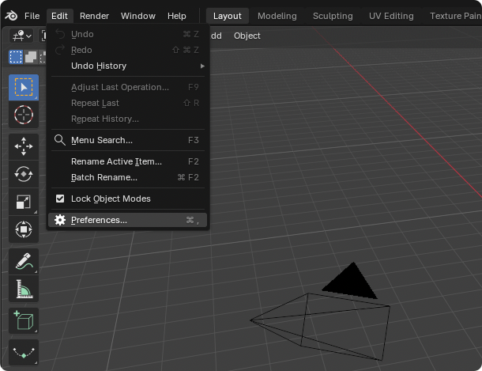

# PartMe Blender MCP：macOS 安装手册

> 支持状态：**VERIFIED**（本机包构建、Runtime 安装、Blender 5.2.1 Add-on 隔离安装）
> 适用：macOS Apple Silicon / Intel、Blender 4.2–5.2  
> 核验日期：2026-09-15

> **发布提醒**：`v0.7.0-rc.2` 是候选版本。只从 GitHub Release 下载，并在安装前核对 SHA-256。

## 1. 下载两个组件

PartMe Blender MCP 包含：

1. `partme-blender-mcp-runtime-0.7.0-rc.2.zip`：由 MCP 客户端启动。
2. `partme-blender-mcp-addon-0.7.0-rc.2.zip`：安装到 Blender。

下载入口：

- [PartMe Blender MCP Releases](https://github.com/full-aigc-plugins/blender-mcp/releases/latest)
- [Blender 官方下载](https://www.blender.org/download/)
- [Blender 官方目录说明](https://docs.blender.org/manual/en/latest/advanced/blender_directory_layout.html)

Apple Silicon 选择 arm64；Intel Mac 选择 x64。

## 2. 校验下载

把两个压缩包和 `SHA256SUMS.txt` 放在同一目录：

```bash
cd "$HOME/Downloads"
shasum -a 256 partme-blender-mcp-addon-0.7.0-rc.2.zip
shasum -a 256 partme-blender-mcp-runtime-0.7.0-rc.2.zip
```

输出必须与 `SHA256SUMS.txt` 完全一致。不同则停止安装。

## 3. 普通用户一键安装

1. 下载 `partme-blender-mcp-macos-arm64-0.7.0-rc.2.tar.gz`。
2. 双击压缩包，macOS 会解压为同名文件夹。
3. 打开文件夹，先阅读 `README-FIRST.txt`。
4. 双击 `install_partme_blender_mcp.command`。
5. 看到 `Installed` 和 MCP 启动命令后关闭终端。

如果系统阻止脚本，先核对 SHA-256，再在 Finder 中右键脚本选择“打开”。不要关闭 Gatekeeper。

熟悉 Python 的用户也可以直接安装平台包本身：

```bash
python3.13 -m pip install ./partme-blender-mcp-macos-arm64-0.7.0-rc.2.tar.gz
```

`Processing ...` 和 `Successfully installed ...` 是 pip 输出，不是下一条命令，不能复制回 zsh。

## 4. 检查 Runtime

```bash
python3 --version
command -v python3
```

首版目标为 Python 3.11–3.13，以 Release manifest 为准。不要覆盖系统 Python。将 Runtime 解压到固定的用户目录，例如 `~/Applications/PartMe-Blender-MCP/`。

正式 Runtime 的检查入口为：

```bash
python3 -m partme_blender_mcp --version
python3 -m partme_blender_mcp doctor --json
```

`v0.7.0-rc.2` 的发布前候选已通过源码 ZIP 的隔离 pip 安装与 MCP initialize 测试；以 GitHub RC 资产和远端 CI 为最终依据。

## 5. 在 Blender 中从磁盘安装

打开 Blender，选择 **Edit → Preferences**：



进入 **Add-ons**，点击右上角菜单，选择 **从磁盘安装…**：


然后：

1. 选择 `partme-blender-mcp-addon-0.7.0-rc.2.zip`，不要解压。
2. 搜索并启用 **PartMe Blender MCP**。
3. 回到 3D View，按 `N`。
4. 打开 **PartMe MCP** 页签。
5. 选择允许写入的输出目录和允许读取的素材目录。
6. 点击 **Start MCP Server**。

不要把社区插件 **MCP for Blender** 当作 PartMe Add-on。

## 6. 配置客户端

- [Codex](codex.zh-CN.md)
- [Claude Desktop](claude-desktop.zh-CN.md)
- [Claude Code](claude-code.zh-CN.md)
- [MiniMax Design](minimax-design.zh-CN.md)
- [Cursor](cursor.zh-CN.md)
- [通用 MCP Client](generic-mcp.zh-CN.md)
- [Windows](windows.zh-CN.md)

## 7. 只读验收

客户端加载 `partme_blender` 后，只调用：

```text
blender_connection_status
blender_scene_inspect
```

通过条件：`connected` 为 `true`；Blender 版本与窗口一致；场景对象可读取；回执没有私有 token；N 面板显示连接。连接成功不授权删除、覆盖、专家 Python 或最终导出。

## 8. Gatekeeper 与权限

先确认 Release 来源和 SHA-256，再处理 macOS 安全提示。不要删除 quarantine 属性、关闭 Gatekeeper 或运行来源不明脚本。Runtime 不应要求管理员权限、完全磁盘访问或公网监听。

## 9. 升级与卸载

升级：Revoke Access → 退出 MCP 客户端 → 校验新版 → 保留旧目录 → 安装新版 → 重启 Blender → 只读验收。失败时恢复旧版本。

卸载：Revoke Access → 在 Preferences 卸载 **PartMe Blender MCP** → 从客户端移除 `partme_blender` → 删除自行选择的 Runtime 目录。保留 `.blend`、输出和素材。

## 10. 排错

- `BLENDER_NOT_CONNECTED`：确认 N 面板已点击 Start MCP Server。
- 找不到 Add-on：重启 Blender，确认 ZIP 顶层为 `partme_blender_mcp/`。
- 找不到 Python：在客户端填写 `command -v python3` 返回的绝对路径。
- 多个 Blender：停止写操作并明确选择窗口，不能自动选最新会话。
