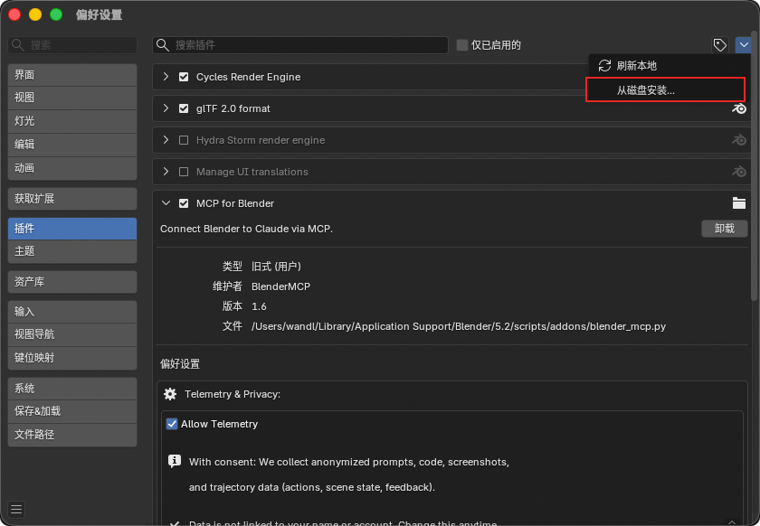

# PartMe Blender MCP：升级手册

> 支持状态：**VERIFIED**（Blender 5.2.1 Add-on 替换与 Runtime 更新验证）  
> 适用：Blender 4.2–5.2、macOS / Windows / Linux  
> 核验日期：2026-09-15

> **发布提醒**：`v0.5.3` 是正式版本。升级前必须从 [GitHub Release](https://github.com/full-aigc-plugins/blender-mcp/releases/latest) 下载新版并校验 SHA-256。

## 1. 升级前检查清单

在做任何改动之前，按顺序完成：

1. 在 Blender N 面板点击 **Revoke Access**。
2. 退出所有正在使用 `partme_blender` 的 MCP 客户端（Codex、Claude Desktop 等）。
3. 下载新版 `partme-blender-mcp-addon-<version>.zip`、`partme-blender-mcp-runtime-<version>.zip` 和 `SHA256SUMS.txt`。
4. 校验 SHA-256：

   ```bash
   shasum -a 256 partme-blender-mcp-addon-<version>.zip
   shasum -a 256 partme-blender-mcp-runtime-<version>.zip
   ```

   Windows 使用 `Get-FileHash -Algorithm SHA256`。结果必须与 `SHA256SUMS.txt` 一致。

5. 备份旧的 Runtime 目录（macOS 默认 `~/Library/Application Support/PartMe/BlenderMCP/`，Windows 默认 `%LOCALAPPDATA%\PartMe\BlenderMCP\`）。

## 2. 升级 Add-on

1. 打开 **Edit → Preferences → Add-ons**。
2. 禁用 **PartMe Blender MCP**。
3. 点击右上角菜单 → **从磁盘安装…**，选择新版 `partme-blender-mcp-addon-<version>.zip`。不要解压。
4. 重新启用 **PartMe Blender MCP**。
5. 回到 3D View，按 `N`，确认 **PartMe MCP** 页签正常显示。



## 3. 升级 Runtime

根据安装方式选择对应步骤：

**使用安装器（推荐）**：

```bash
# macOS
bash install_partme_blender_mcp.command --dry-run
bash install_partme_blender_mcp.command
```

```powershell
# Windows
.\install_partme_blender_mcp.ps1 -DryRun
.\install_partme_blender_mcp.ps1
```

**手动 pip 安装**：

```bash
python -m pip install --upgrade ./partme-blender-mcp-runtime-<version>.zip
python -m partme_blender_mcp --version
```

升级顺序：先升级 Add-on，再升级 Runtime。如果反序，旧 Add-on 可能引用新 Runtime 中已变更的接口。

## 4. 升级后验收

在 N 面板点击 **Start MCP Server**，然后在 MCP 客户端中只调用：

```text
blender_connection_status
blender_scene_inspect
```

通过条件：

- `connected` 为 `true`。
- `blender_connection_status` 返回的版本号与安装版本一致。
- `blender_scene_inspect` 可读取当前场景对象。
- 回执不含私有 token。
- N 面板显示 Connected。

只读验收不授权删除、覆盖、专家 Python 或最终导出。

## 5. 版本不兼容时回退

如果升级后验收失败：

1. 在 N 面板点击 **Revoke Access**。
2. 禁用新版 Add-on。
3. 从备份目录恢复旧版 Runtime。
4. 从磁盘安装旧版 Add-on ZIP。
5. 重启 Blender，重新启用并执行只读验收。

## 6. 读取 runtime-manifest.json

Release 中包含 `runtime-manifest.json`，用于确认版本兼容性：

| 字段 | 含义 | 示例 |
|:---|:---|:---|
| `version` | Runtime 版本号 | `"0.5.3"` |
| `commit` | 构建所用的 Git 提交 | `"a1b2c3d..."` |
| `python` | 支持的 Python 版本范围 | `"3.11-3.13"` |
| `blender` | 支持的 Blender 版本范围 | `"4.2-5.2"` |
| `status` | 发布状态 | `"prerelease"` |
| `mcpProtocol` | MCP 协议版本 | `"2025-06-18"` |

升级前确认 `python` 和 `blender` 字段覆盖你的环境版本。`status` 为 `prerelease` 表示预发布，生产使用需评估风险。

## 7. 相关文档

- [Blender Add-on 安装与操作](blender-addon.zh-CN.md)
- [macOS 安装](macos.zh-CN.md)
- [Windows 安装](windows.zh-CN.md)
- [卸载手册](uninstall.zh-CN.md)
