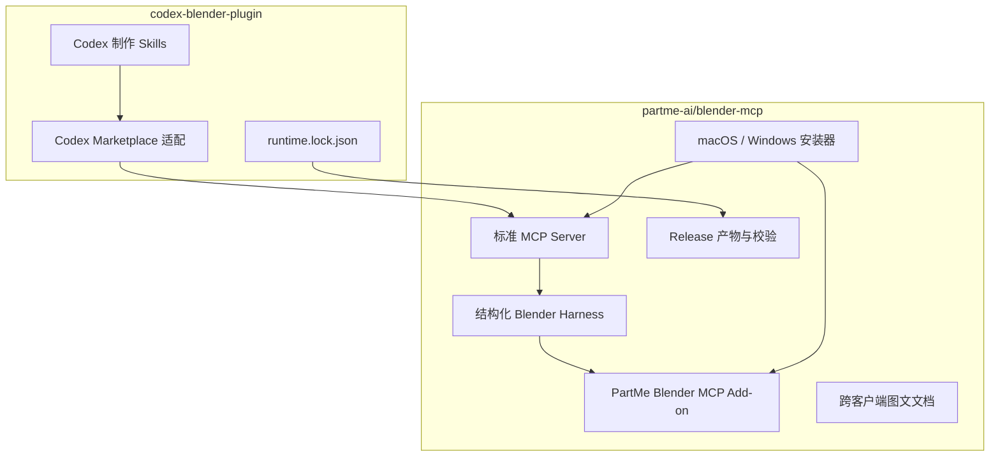
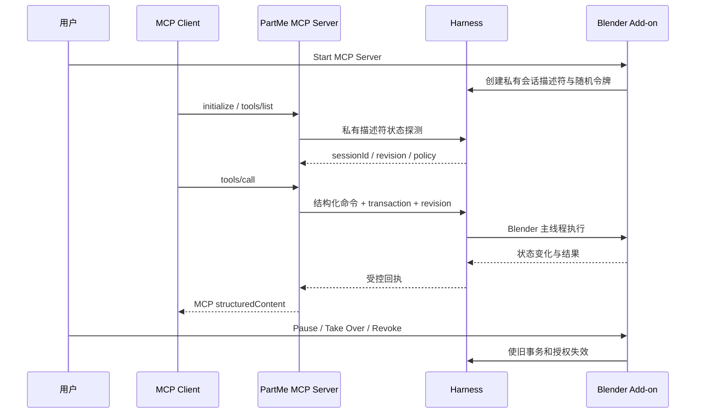
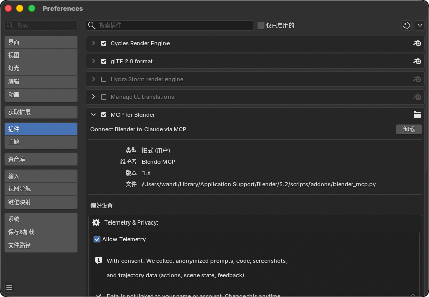
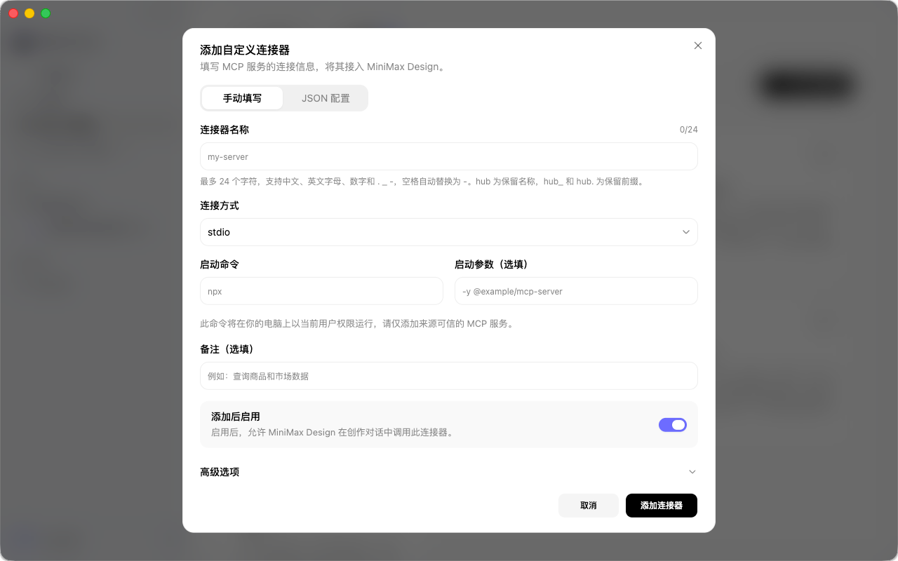
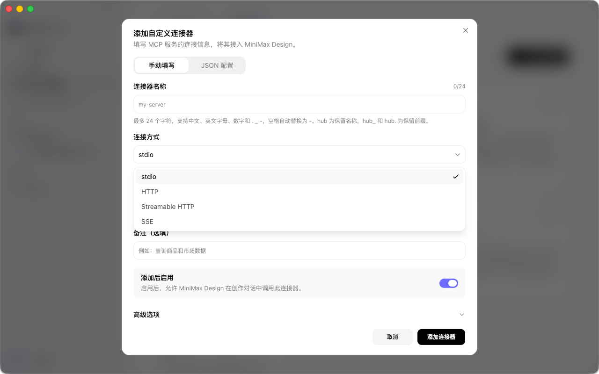

# PartMe Blender MCP 跨客户端运行时设计

> 状态：待用户评审  
> 仓库：`partme-ai/blender-mcp`  
> 产品名：`PartMe Blender MCP`  
> 来源系统：`partme-ai/codex-blender-plugin`

## 1. 目标

建立独立、开源、跨客户端的 Blender MCP 运行时，使 Codex、Claude、MiniMax Design、
Cursor 和其他兼容 MCP 的宿主共享同一套受控 Blender 能力，而不要求用户安装带有某个
模型或客户端品牌的 Blender Add-on。

首个正式版本必须交付：

- 标准 stdio MCP Server；
- Blender 内可见、可撤销的安全 Add-on；
- 复用现有结构化 Harness 的建模、动画、渲染、检查和导出能力；
- macOS 与 Windows 安装、升级和卸载入口；
- GitHub Release 中可直接下载的版本化产物和 SHA-256 清单；
- Codex、Claude、MiniMax Design、Cursor、通用 MCP Client 的独立图文教程；
- 真实客户端握手、Blender 运行和恢复证据。

“可安装”不能只表示源码可以运行。用户必须能从 Release 下载明确的文件，按文档完成
Blender Add-on 与 MCP Client 两端安装，并通过状态工具判断连接是否成立。

## 2. 非目标

- 不提供文生 3D 模型服务，不捆绑 Rodin、混元、Sketchfab 或其他云端供应商。
- 不负责剧本生成、即梦上传、视频生成计费或跨镜头制片。
- 不把任意 `exec()` 当作正常制作接口；专家 Python 继续是单独授权的高风险能力。
- 不在首次启动时静默下载 Blender、Python、扩展或资产。
- 不承诺未经真实运行验证的平台或客户端。

## 3. 命名和身份

| 类型 | 正式名称 |
|---|---|
| GitHub 仓库 | `partme-ai/blender-mcp` |
| 产品显示名 | `PartMe Blender MCP` |
| Python 包/命令 | `partme-blender-mcp` / `partme-blender-mcp` |
| MCP Server ID | `partme_blender` |
| Blender Add-on | `PartMe Blender MCP` |
| Python 模块 | `partme_blender_mcp` |
| MCP tool 前缀 | `blender_` |
| Harness 协议 | 首期兼容 `codex-blender/v1`，稳定后迁移为 `partme-blender/v1` |

工具名使用单下划线 snake_case，例如：

```text
blender_scene_inspect
blender_object_create_mesh
blender_animation_pose_keyframe
blender_export_file
```

Harness 命令 ID 保留点分形式，例如 `animation.pose_keyframe`。MCP 目录生成时必须验证
一一映射；两个 Harness ID 映射到同一个 MCP 名称时，构建和启动均失败。

旧的 `Codex Blender Connector`、`codex_blender` MCP Server ID 和旧缓存入口保留一个兼容
版本，但新文档和新安装不再推荐这些名称。已经废弃的双下划线工具名不提供长期别名，避免
工具目录膨胀和含糊调用。

## 4. 仓库职责



`blender-mcp` 是运行时唯一代码事实源。`codex-blender-plugin` 保留 Codex 专属的制作路由、
交付策略与 Marketplace 元数据，通过锁文件引用已经验证的 runtime 版本和 SHA-256。

迁移期允许 Codex 仓库保留兼容副本，但必须由差分测试证明与独立仓库一致。迁移完成后不得
手工维护两份 Harness。

## 5. 运行架构



MCP Server 只翻译协议，不重新实现 Blender 操作。命令 schema、风险级别、成熟度和可用性
来自 Harness 注册表。

### 5.1 会话发现

- macOS 优先使用权限为 `0600` 的 Unix Domain Socket 描述符；
- Windows 使用当前用户可访问的 Named Pipe；
- Linux 仅在明确声明的实验模式使用带令牌的 loopback TCP；
- 描述符不得是符号链接，不得向 MCP Client 返回 token；
- 没有会话时返回 `BLENDER_NOT_CONNECTED` 和本地安装指导；
- 多个活动会话时返回 `AMBIGUOUS_SESSION`，不得默认选择最新窗口；
- 外部文件加载、用户接管或撤销连接后，旧授权失效。

### 5.2 客户端身份

每个 MCP 连接记录 `clientInfo.name/version` 和本地会话实例 ID。一个 Blender Harness 默认只
允许一个主动写入客户端；其他客户端可处于只读观察状态。切换写入客户端必须由 Blender 本地
UI 确认。客户端身份不是远程账号，不发送到 PartMe 服务。

### 5.3 授权

不能信任 MCP 参数中的 `userConfirmed: true`。以下操作必须由 Blender 本地弹窗或宿主提供的
可信审批桥签发动作绑定授权：

- 删除对象或数据；
- 覆盖已有文件；
- 专家 Python；
- 打开、替换或关闭工程；
- 最终导出和外部动作。

授权绑定 `sessionId + clientInstanceId + requestId + action + TTL`，不可复用到循环或其他客户端。

## 6. 分发产物

每个 GitHub Release 必须包含：

```text
partme-blender-mcp-addon-<version>.zip
partme-blender-mcp-runtime-<version>.zip
partme-blender-mcp-macos-arm64-<version>.tar.gz
partme-blender-mcp-windows-x64-<version>.zip
runtime-manifest.json
SHA256SUMS.txt
SBOM.spdx.json
```

### 6.1 Add-on ZIP

可直接通过 Blender `Preferences → Add-ons → 从磁盘安装` 选择，不需要解压。ZIP 顶层只有
`partme_blender_mcp/`，包含 Add-on、Harness 运行层和版本元数据。

### 6.2 Runtime ZIP

包含标准 Python stdio MCP Server、零第三方运行依赖的核心模块、客户端配置模板和检测工具。
运行入口稳定为：

```text
python -m partme_blender_mcp
```

平台包可以包含隔离 Python 启动器，但不得捆绑 Blender。源码用户可使用 Python 3.11–3.13；
支持范围以真实测试为准。

### 6.3 供应链

- Release workflow 从 tag 对应 commit 构建，不接受手工上传覆盖同名文件；
- `runtime-manifest.json` 记录版本、commit、协议、Python、Blender 和文件 SHA；
- `SHA256SUMS.txt` 覆盖所有下载产物；
- 生成 SPDX SBOM；
- 依赖许可证记录在 `THIRD_PARTY_NOTICES.md`；
- 正式版本禁止从未固定分支运行安装代码。

## 7. 安装、升级和卸载

### 7.1 Blender Add-on 通用步骤

1. 从 Release 下载 `partme-blender-mcp-addon-<version>.zip`。
2. Blender 中打开 `Edit → Preferences → Add-ons`。
3. 右上角菜单选择 `从磁盘安装…`。
4. 选择 ZIP，启用 **PartMe Blender MCP**。
5. 回到 3D View，按 `N`，打开 **PartMe MCP**。
6. 选择允许的输出/素材目录，点击 **Start MCP Server**。

安装文档使用用户提供的 Blender 5.2.1 中文界面截图：


另有一张显示社区 `MCP for Blender` 的截图仅作为 Add-ons 页面位置参考，不得用作启用
PartMe Add-on 的最终指引：



正式手册必须对参考图进行明确标注，不能暗示用户启用社区插件。

### 7.2 macOS

`install_partme_blender_mcp.command`：

- 显示将写入的用户目录；
- 检测 Blender 4.2–5.2 的用户 Add-ons 目录；
- 安装前备份同名旧版本；
- 不申请管理员权限，不修改系统 Python；
- 输出 MCP Client 配置路径和下一步；
- 支持 `--dry-run` 和 `--version`。

`uninstall_partme_blender_mcp.command` 只删除 manifest 中记录的明确文件，保留用户 `.blend`、
输出和素材目录。

### 7.3 Windows

`install_partme_blender_mcp.bat` 与 PowerShell 实现：

- 检测 `py -3`/`python` 和 Blender 用户目录；
- 不修改执行策略、不要求管理员权限；
- 生成适配 Windows 路径转义的 MCP 配置；
- 安装失败时恢复备份；
- 支持 dry-run、升级和明确卸载。

### 7.4 升级

升级顺序为停止 MCP → Revoke Access → 备份旧 Add-on → 校验下载 SHA → 安装 → 重启 Blender
→ 握手与只读 smoke。版本不兼容时保留旧版并停止，不自动降级数据。

## 8. 客户端文档

文档目录：

```text
docs/getting-started/
├── blender-addon.zh-CN.md
├── blender-addon.md
├── codex.zh-CN.md
├── claude-desktop.zh-CN.md
├── claude-code.zh-CN.md
├── minimax-design.zh-CN.md
├── cursor.zh-CN.md
├── generic-mcp.zh-CN.md
├── macos.zh-CN.md
├── windows.zh-CN.md
├── upgrade.zh-CN.md
└── uninstall.zh-CN.md
```

每份客户端文档必须包含：

- 适用的客户端版本和核验日期；
- Release 下载链接，而非开发机绝对路径；
- 可复制配置；
- `partme_blender` 是否成功加载的检查方法；
- `blender_connection_status` 与 `blender_scene_inspect` 的只读验证；
- 常见错误和撤销方式；
- 不把客户端登录、API Key 或云端权限混入 Blender MCP。

### 8.1 MiniMax Design 已确认的配置入口

用户提供的当前 MiniMax Design 界面证明它具备 **添加自定义连接器** 功能，包含：

- 手动填写与 JSON 配置两个入口；
- 连接器名称；
- `stdio` 连接方式；
- 启动命令；
- 启动参数；
- 备注、启用开关和高级选项。



用户补充截图还确认连接方式下拉框包含 `stdio`、`HTTP`、`Streamable HTTP` 和 `SSE`：



因此 MiniMax Design 不再标记为“未知是否存在配置入口”。但截图不能证明参数序列化、环境变量、
分页、`structuredContent`、授权交互或真实 Blender 往返已经兼容；这些项目仍须通过目标版本的
实际握手验证后才能标为支持。首版只承诺本地 `stdio`；HTTP、Streamable HTTP 和 SSE 属于后续
传输扩展，必须先补认证、监听范围、会话隔离和网络威胁模型。手册可以按已观察字段编写配置
步骤，不得臆造高级选项内容。

## 9. 自动检测

提供 `partme-blender-mcp doctor --json`，检查：

- 操作系统与架构；
- Python 版本；
- Blender 可执行文件和版本；
- Add-on 安装路径、版本和启用状态；
- MCP Runtime 版本；
- 活动 Harness 数量；
- 描述符权限、进程和传输可达性；
- 客户端配置是否指向当前 runtime；
- 工具目录数量和命名冲突；
- 输出/素材目录是否在用户授权范围内。

检测默认只读。修复操作单独使用 `doctor --fix <明确项>`，执行前列出将改动的文件。

## 10. 测试与验证

### 10.1 自动测试

1. MCP JSON-RPC：initialize、notifications、分页 tools/list、tools/call、错误隔离。
2. Registry parity：每个 Harness 命令恰有一个 snake_case MCP tool。
3. 安全：私有描述符、令牌不泄漏、路径限制、授权绑定、跨客户端互斥。
4. 安装器：全新安装、升级、回滚、卸载、dry-run、带空格路径。
5. 打包：ZIP 结构、manifest、SHA、SBOM、可复现性。
6. 文档：链接、下载文件名、配置模板与 Release 资产一致。

### 10.2 真实平台矩阵

| 平台 | Blender | MCP Client | 最低验收 |
|---|---|---|---|
| macOS arm64 | 4.2 LTS、5.2 LTS | Codex、Claude Desktop、Claude Code | 安装、握手、只读、建模事务、撤销、重启 |
| Windows x64 | 4.2 LTS、5.2 LTS | Codex、Claude Desktop、Cursor | 安装、Named Pipe、只读、建模事务、恢复、卸载 |
| macOS/Windows | 5.2 LTS | MiniMax Design | 配置入口已由用户截图确认；真实 stdio 握手、分页、调用和授权仍为 `NOT_RUN` |
| Linux | 4.2 LTS | Generic MCP Inspector | 实验性 loopback，不能替代桌面平台证据 |

客户端握手成功不代表 Blender 制作能力全部通过；仍需运行固定的场景检查、建模事务、回滚和
导出样例。

## 11. 迁移计划边界

迁移按以下门禁推进，任何一步失败都保留现有 Codex Runtime：

1. 从 `codex-blender-plugin` 提取纯运行时代码和测试，不改行为。
2. 在新仓库重现现有 Python、macOS Blender 和 Windows L4 证据。
3. 完成中性命名，但 Harness 命令 ID 和回执保持兼容。
4. 构建 Add-on/Runtime Release 资产和校验清单。
5. 完成 Codex 与至少一个非 Codex 客户端真实验证。
6. 在 `codex-blender-plugin` 增加 `runtime.lock.json` 和差分门禁。
7. 切换 Codex Marketplace 到固定 runtime，保留旧入口一个版本。
8. 确认恢复和回滚后，才移除 Codex 仓库的重复 runtime。

## 12. 完成标准

首个跨客户端版本只有在以下全部满足时才可称为可发布：

- 新仓库是 Harness、MCP Server 和 Add-on 的唯一运行时事实源；
- GitHub Release 提供所有约定产物，SHA 和 SBOM 可验证；
- Blender 可以通过从磁盘安装 ZIP 完成 Add-on 安装；
- macOS 和 Windows 安装、升级、卸载均有实际证据；
- Codex 与至少一个非 Codex MCP Client 完成真实 Blender 写入与回滚；
- 164 条供应商中立、非专家 Python 的 Blender 命令有唯一 MCP tool；供应商上传和任意 Python 不进入公共目录，危险操作仍由 Harness 拒绝未授权调用；
- 文档不包含开发机绝对路径、虚构菜单或错误的社区 Add-on 指引；
- `codex-blender-plugin` 固定消费经过校验的 runtime 版本；
- 未验证客户端和平台明确标为 `NOT_RUN`。

## 13. 待用户确认的设计决策

本规格采用以下默认决定：

1. 新仓库使用 Apache-2.0。
2. Python 包名使用 `partme-blender-mcp`，MCP Server ID 使用 `partme_blender`。
3. Blender Add-on 页签使用 **PartMe MCP**，按钮使用 **Start MCP Server**。
4. GitHub Release 是普通用户唯一推荐的下载入口。
5. Codex 仓库通过版本锁和校验消费 runtime，不使用 Git submodule。
6. 旧 `Codex Blender Connector` 兼容一个发布版本。

这些决定经用户确认后，下一阶段才编写逐文件实施计划。
