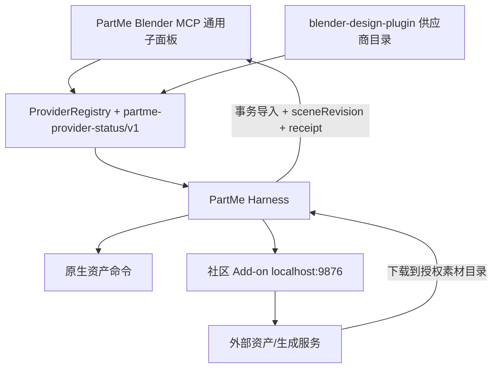

# PartMe Blender MCP 供应商整合设计

> 状态：已确认实施  
> 目标版本：`blender-mcp 0.4.0` / `blender-design 0.10.0`
> 前置基线：已发布的 `blender-mcp 0.2.1` 不覆盖、不重传同名资产

## 1. 目标

在不削弱 PartMe Harness 安全边界的前提下，吸收社区 Blender MCP 的资产库与 AI 三维生成能力：

- `blender-mcp` 提供供应商注册表、状态协议、通用 Blender 子面板与受控导入闭环；
- `blender-design-plugin` 提供社区供应商目录、安装适配和 MCP 宿主扩展；
- Poly Pizza 只保留 PartMe 原生命令为主路径；
- 社区搜索、下载、生成、导入具有不同风险级别；
- 下载与生成结果必须落入授权素材目录，再通过 Harness 事务导入并返回回执；
- 社区 Add-on 仍是可选 sidecar，不成为第二个 PartMe 连接或授权入口。

## 2. 非目标

- 不把供应商密钥写入 `.blend`、Scene 自定义属性或 MCP 返回值；
- 不允许社区 `execute_code`、任意 URL、任意文件路径绕过 Harness；
- 不把供应商可用状态等同于已付费、已授权或生产验收通过；
- 不覆盖已经发布的 `v0.2.1` Release 资产；
- 不用静态截图代替真实 Blender 和客户端验收。

## 3. 分层与所有权



`blender-mcp` 是协议、UI 和安全编排事实源；`blender-design-plugin` 只贡献供应商描述和宿主适配。

## 4. 供应商协议

状态对象使用 `partme-provider-status/v1`：

```json
{
  "schemaVersion": "partme-provider-status/v1",
  "providerId": "sketchfab",
  "category": "asset_library",
  "source": "community",
  "state": "configuration_required",
  "label": "Sketchfab",
  "statusText": "需要配置",
  "risks": ["read", "network_download", "scene_import"],
  "actions": ["configure"]
}
```

合法类别：

- `asset_library`
- `ai_model`

合法状态：

- `ready`
- `disabled`
- `configuration_required`
- `unavailable`
- `busy`
- `error`

合法风险：

- `read`
- `network_download`
- `paid_generation`
- `scene_import`
- `external_export`

注册表拒绝重复 ID、未知类别/状态/风险和包含 `apiKey`、`token`、`secret`、`password` 的公开元数据。

## 5. UI

视觉与交互定稿见：[PartMe Blender MCP 侧栏界面设计 V1](../../design/partme-blender-mcp-sidebar-ui-v1.md)。

在 `PartMe MCP` 页签下保留一个连接权威，并增加三个子面板：

1. `权限与执行`：授权目录、执行模式、替身策略；
2. `资产与素材库`：本地素材库、Poly Haven、Sketchfab、Poly Pizza；
3. `AI 生成模型`：Hyper3D Rodin、腾讯混元 3D。

供应商行显示图标、名称、文字状态和必要动作；不得只用颜色或复选框表达状态。`PartMe 制作过程`
继续显示实时任务、审批、接管、撤销、视图与播放控制。

`权限与执行`、`资产与素材库`、`AI 生成模型`、`PartMe 制作过程`首次显示时全部默认展开；
用户手动折叠后可遵循 Blender 的界面状态记忆。原有相机、正面、侧面、顶面、播放/暂停和帧定位快捷操作必须保留。

## 6. Poly Pizza 单路径

- 公共能力只暴露 `asset.polypizza_search` 与 `asset.polypizza_download`；
- 社区桥不再允许 `get_polypizza_status`、`search_polypizza_models`、`download_polypizza_model`；
- 下载写入授权素材根下的 `polypizza/<modelId>/`，同时写入许可证 sidecar；
- 下载完成不自动修改场景，导入必须另行调用 `asset.import_file`。

## 7. 风险和导入闭环

| 动作 | 风险 | 规则 |
|---|---|---|
| 状态、分类、搜索、轮询 | `read` | 不修改场景，不写文件 |
| 下载资产/生成结果 | `network_download` | 仅写授权素材目录，限制主机、后缀和大小 |
| 提交 Rodin/混元生成 | `paid_generation` | 已授权预算内默认自动；未授权或超出预算时形成 Blender 本地待审批项 |
| 导入模型/设置贴图 | `scene_import` | 必须使用事务和最新 `sceneRevision` |
| 外部导出 | `external_export` | 延续 Harness 本地审批 |

社区的直接 `import_generated_asset*` 不再作为插件公共主路径。生成服务返回 URL 或文件后，宿主先下载到授权目录，
再调用 PartMe 的 `asset.import_file`，由 Harness 生成 changedObjects、sceneRevision、快照和回执。

进行中的生成任务必须可终止。终止至少停止本地轮询、下载和后续导入；供应商支持取消接口时同时取消远端任务，
不支持时必须明确提示远端任务可能仍在运行。`终止生成`不等同于暂停整个制作会话或撤销 MCP 连接。

## 8. 版本与兼容

- `v0.2.1` 已发布，先记录其版本漂移基线，不修改远端资产；
- 本增量使用 `blender-mcp 0.4.0`；
- 插件使用 `blender-design 0.10.0`，锁定新的 runtime/add-on/community SHA；
- 旧 `blender_community_call` 保留一个版本，但对已移除的 Poly Pizza 和直接导入命令返回结构化迁移错误；
- `scripts/harness/` 暂不删除，建立带 SHA 的差分门禁并声明只读兼容边界。

## 9. 验收

- 供应商注册表与状态协议单元测试通过；
- 两个通用子面板存在，窄宽度下不依赖横向布局；
- 所有主要区块首次显示时默认展开，原有视图与播放快捷操作保留；
- 自动生成在已授权预算内不中断制作，并提供语义准确的终止操作；
- Poly Pizza 公共路径只有 PartMe 原生命令；
- 插件扩展工具跨页只出现一次；
- 版本、README、Add-on 元数据、producer 与发布包一致；
- 新发布包可复现构建，SHA/manifest/SBOM 一致；
- 真实 Blender 验证折叠、缺密钥、错误、busy、审批和导入回执；
- Codex、ZCode、Kimi、Windows 结果分别记录为 `PASS`、`FAIL` 或 `NOT_RUN`，不得互相替代。
