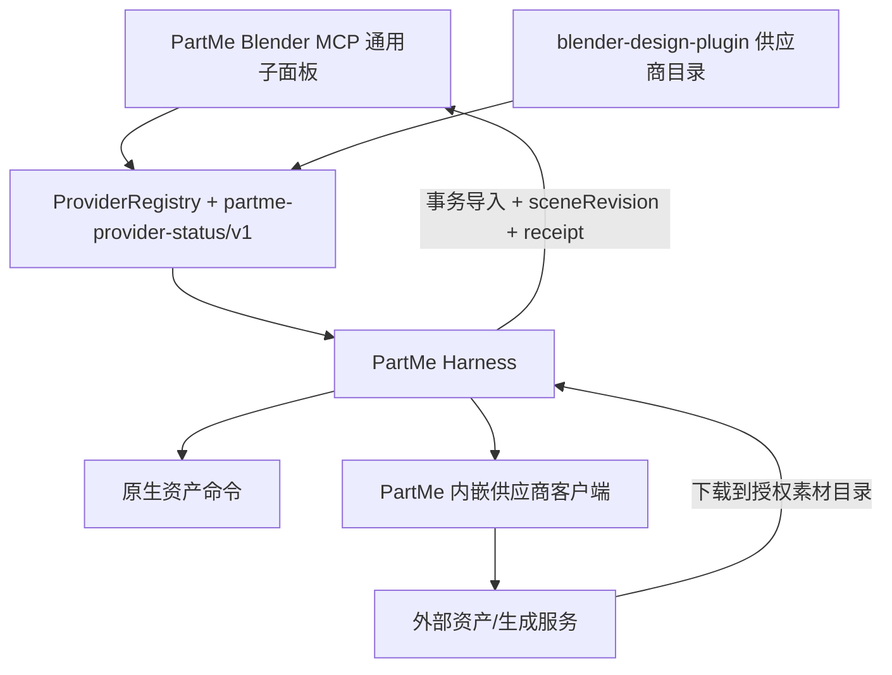

# PartMe Blender MCP 供应商整合设计

> 状态：已确认实施  
> 目标版本：`blender-mcp 0.5.1` / `blender-design 0.11.0`
> 前置基线：已发布的 `blender-mcp 0.2.1` 不覆盖、不重传同名资产

## 1. 目标

在不削弱 PartMe Harness 安全边界的前提下，吸收社区 Blender MCP 的资产库与 AI 三维生成能力：

- `blender-mcp` 提供供应商注册表、状态协议、通用 Blender 子面板与受控导入闭环；
- `blender-design-plugin` 提供社区供应商目录、安装适配和 MCP 宿主扩展；
- Poly Pizza 只保留 PartMe 原生命令为主路径；
- 社区搜索、下载、生成、导入具有不同风险级别；
- 下载与生成结果必须落入授权素材目录，再通过 Harness 事务导入并返回回执；
- 仅安装 PartMe Add-on；社区 HTTP 客户端作为内部实现复用，不注册社区面板，不启动 9876 服务。供应商凭证与启停均由 PartMe 管理。

## 2. 非目标

- 不把供应商密钥写入 `.blend`、Scene 自定义属性或 MCP 返回值；
- 不允许社区 `execute_code`、任意 URL、任意文件路径绕过 Harness；
- 不把供应商可用状态等同于已付费、已授权或生产验收通过；
- 不覆盖已经发布的 `v0.2.1` Release 资产；
- 不用静态截图代替真实 Blender 和客户端验收。

## 3. 分层与所有权



`blender-mcp` 是协议、UI 和安全编排事实源；`blender-design-plugin` 只贡献供应商描述和宿主适配。

## 4. 供应商协议

状态对象使用 `partme-provider-status/v1`：

```json
{
  "schemaVersion": "partme-provider-status/v1",
  "providerId": "sketchfab",
  "category": "asset_library",
  "source": "community",
  "enabled": false,
  "mutable": true,
  "configurable": true,
  "toggleLocked": true,
  "state": "configuration_required",
  "label": "Sketchfab",
  "statusText": "需要配置",
  "risks": ["read", "network_download", "scene_import"],
  "actions": ["configure"]
}
```

合法类别：

- `asset_library`
- `ai_model`

合法状态：

- `ready`
- `disabled`
- `configuration_required`
- `unavailable`
- `busy`
- `error`

合法风险：

- `read`
- `network_download`
- `paid_generation`
- `scene_import`
- `external_export`

注册表拒绝重复 ID、未知类别/状态/风险和包含 `apiKey`、`token`、`secret`、`password` 的公开元数据。

### Hyper3D 双鉴权边界

Hyper3D 提供两条独立接入路径，不能把两者的凭证混用：

- `MCP OAuth`（免费账户首选）：当前 Codex 或 Claude Code 连接固定 Streamable HTTP 端点
  `https://api.hyper3d.com/api/mcp`，由客户端执行 OAuth 2.1/PKCE 浏览器授权并保管刷新凭据。Blender 只记录“客户端、端点、授权状态”，
  不读取、不复制、不持久化 OAuth Token。生成由客户端调用 `hyper3d` MCP，结果链接再交给 PartMe 的授权目录下载与事务导入。
- `API Key`：Blender 用户配置保存开发者 API Key，直接调用 `https://api.hyper3d.com/api/v2`；Key 不写入 `.blend`、日志、回执或状态。
  `fal.ai` 保持为独立 API Key 平台。旧 `hyperhuman.deemos.com` 域名不再用于 PartMe 原生路径。

客户端授权按钮必须复用同名同地址配置；缺失时新增，同名异地址时停止并要求人工确认，禁止覆盖其他 MCP 设置。`mcp add`/`mcp login`
必须作为后台进程运行，授权期间 Blender UI 可继续操作。配置完成不等于本轮生成获批；任何可能消耗积分的提交仍进入 `paid_generation` 审批。

首次授权不能只执行 `mcp add`：正确序列是“同名配置缺失时 `add` 后 `login`，同名同地址已存在时只 `login`”。插件读取客户端输出时只允许打开
`https://api.hyper3d.com/api/grant/oauth/authorize` 授权页，不记录或显示授权 URL 中的临时 `state`、PKCE challenge 和回调参数；OAuth Token 继续只由客户端保管。

`blender_rodin_bridge_v0.2.0.zip` 的参考实现不是 OAuth 或 API Key 客户端。它打开 `hyper3d.ai?show=plugin`，复用浏览器账户会话，再通过仅绑定
`127.0.0.1` 的 WebSocket 在网页与 Blender 间交换任务和模型；其 `rodin_auth` 处理器固定返回 `OK`。PartMe 只借鉴“免费账户由浏览器登录”的产品路径，
不得复制该无鉴权 WebSocket 协议，也不得把浏览器 Cookie 当成 API Key。

2026-09-20 的直接协议探测确认该端点支持 MCP `2025-06-18`，公开目录包含上传、图片导入、Rodin/BANG 生成、状态、等待与结果读取工具。
工具目录可在未登录时发现，但实际 `tools/call` 返回 401，并通过 protected-resource metadata 声明 `rodin:generate`、`rodin:read` 和授权服务器；
授权服务器支持 Authorization Code、Refresh Token、Device Code 与 PKCE S256。因此 UI 不得把“目录可发现”误报为“已授权”，也不得把 OAuth 路径退化为 API Key 输入框。

OAuth 客户端报告 `authorized` 也不能直接映射为供应商 `ready`。`ready` 必须以该客户端完成 `initialize` / `notifications/initialized` 并能读取工具目录的实际连接证据为准；只有授权、尚未验证连接时显示“OAuth 已授权 · 客户端连接待验证”，状态不计入可用供应商。2026-09-21 的 Codex `0.147.0`、`0.153.4` 与桌面内置 `0.155.0-alpha.9.2` 实测均因服务端 HTTP 202 空通知响应缺少 `Content-Type` 而在 initialized 通知阶段失败，当前不能把 Codex 路径标记为可用。`0.153.4` 完成 OAuth 后能够在失败前发现 7 个工具，但“工具目录已发现”仍不等于完整握手成功。

`enabled`是用户偏好，`state`是运行事实，两者必须独立。只有`enabled = true`且状态为`ready`或`busy`的供应商计入
`供应商可用`并进入自动路由。本地素材库固定启用；外部供应商可以启停。配置缺失时开关禁用，任务运行时开关锁定，
用户必须通过独立的终止动作结束任务。供应商启用偏好保存在 Blender 用户配置中，不写入`.blend`；社区供应商同时把
偏好同步到其真实`blendermcp_use_*`运行属性。临时离线或状态探测错误不得清除用户偏好；开关可以保持启用，但调用仍由
路由门禁以`PROVIDER_UNAVAILABLE`拒绝，待供应商恢复后自动重新进入候选集。

## 5. UI

视觉与交互定稿见：[PartMe Blender MCP 侧栏界面设计 V1](../../design/partme-blender-mcp-sidebar-ui-v1.md)。

在 `PartMe MCP` 页签下只注册一个工作台面板。顶部显示服务状态、场景版本、供应商可用数和刷新/执行设置；内容通过
`制作`、`素材`、`模型`、`接入`四个原生 Tab 切换，默认显示`制作`。旧权限、素材、模型、制作过程子面板不再并排注册。

供应商行显示图标、名称、文字状态和必要动作；不得只用颜色或复选框表达状态。`PartMe 制作过程`
继续显示实时任务、审批、接管、撤销、视图与播放控制。

供应商行显示图标、名称、文字状态、必要动作和真实启用开关。本地素材库显示`始终启用`。配置按钮必须打开对应供应商
设置；不得仅报告环境变量或打开无定位的空白偏好页。原有相机、正面、侧面、顶面、播放/暂停和帧定位快捷操作必须保留。

## 6. Poly Pizza 单路径

- 公共能力只暴露 `asset.polypizza_search` 与 `asset.polypizza_download`；
- 社区桥不再允许 `get_polypizza_status`、`search_polypizza_models`、`download_polypizza_model`；
- 下载写入授权素材根下的 `polypizza/<modelId>/`，同时写入许可证 sidecar；
- 下载完成不自动修改场景，导入必须另行调用 `asset.import_file`。

所有供应商搜索、短效结果解析和下载均不得在 Blender 主线程执行。上述公开命令以及
`asset.fetch_url`、`asset.fetch_generated` 立即返回 `operationId`；客户端使用
`asset.operation_result(providerId, taskId)` 读取终态，使用
`provider.task_control(operation="cancel", ...)` 本地终止。取消、会话撤销或执行设置重载后，
晚到结果不得回写，未完成文件和临时解压目录必须清理；完成结果只返回授权目录内路径，不返回签名 URL。

## 7. 风险和导入闭环

| 动作 | 风险 | 规则 |
|---|---|---|
| 状态、分类、搜索、轮询 | `read` | 不修改场景，不写文件 |
| 下载资产/生成结果 | `network_download` | 仅写授权素材目录，限制主机、后缀和大小 |
| 提交 Rodin/混元生成 | `paid_generation` | 已授权预算内默认自动；未授权或超出预算时形成 Blender 本地待审批项 |
| 导入模型/设置贴图 | `scene_import` | 必须使用事务和最新 `sceneRevision` |
| 外部导出 | `external_export` | 延续 Harness 本地审批 |

社区的直接 `import_generated_asset*` 不再作为插件公共主路径。生成服务返回 URL 或文件后，宿主先下载到授权目录，
再调用 PartMe 的 `asset.import_file`，由 Harness 生成 changedObjects、sceneRevision、快照和回执。

进行中的生成任务必须可终止。终止至少停止本地轮询、下载和后续导入；供应商支持取消接口时同时取消远端任务，
不支持时必须明确提示远端任务可能仍在运行。`终止生成`不等同于暂停整个制作会话或撤销 MCP 连接。

查询响应必须携带非空字符串状态或非空状态列表。空对象、缺失状态及无效状态类型应计入连续失败次数，
在有限重试后停止自动查询并明确提示“远端状态未知”；不得将网络查询失败断言为远端生成失败，也不得自动重新提交付费任务。

## 8. 版本与兼容

### 本地混元接口适配

本地服务沿用 `/generate` 返回 GLB 二进制的接口，不将它伪装为腾讯云 JobId 协议。PartMe 在后台请求服务，立即返回
`local_` 前缀任务 ID。主线程提前复制配置，后台不读取 `bpy`；查询和终止使用统一任务状态。
生成前必须已有授权素材根。参考图必须来自当前授权素材文件，PNG/JPEG 上限 20MB；外部参考图先通过受控素材下载暂存。
返回结果最多 500MB，验证 GLB 文件头、版本和声明长度后暂存到授权根的独立目录，不覆盖已有文件，不直接导入场景。
由于服务在生成响应中直接返回文件，接收并暂存属于该生成请求的结果处理；获取暂存路径和事务导入仍为后续独立操作。
`poll_hunyuan_job_status` 查询 `local_` 任务可返回已暂存路径；`asset.fetch_generated` 也可通过该引用取得结果，并再次检查
当前授权目录。终止后不得返回可导入路径，供应商远端可能继续计算。进程重启后不自动重新提交生成，不假装恢复内存任务。

- `v0.2.1` 已发布，先记录其版本漂移基线，不修改远端资产；
- 本增量使用 `blender-mcp 0.5.1`；
- 插件使用 `blender-design 0.11.0`，锁定新的 runtime/add-on/community SHA；
- 旧 `blender_community_call` 保留一个版本，但对已移除的 Poly Pizza 和直接导入命令返回结构化迁移错误；
- `scripts/harness/` 暂不删除，建立带 SHA 的差分门禁并声明只读兼容边界。

## 9. 验收

- 供应商注册表与状态协议单元测试通过；
- 单工作台四 Tab 在窄宽度下不截断关键状态，默认显示制作；
- 外部供应商开关真实控制社区 handler/PartMe 原生命令路由，配置缺失和 busy 状态不可误切；
- 配置入口定向打开对应 Add-on Preferences，密钥不进入 Scene、状态、日志或回执；
- 原有视图与播放快捷操作保留；
- 自动生成在已授权预算内不中断制作，并提供语义准确的终止操作；
- Poly Pizza 公共路径只有 PartMe 原生命令；
- 插件扩展工具跨页只出现一次；
- 版本、README、Add-on 元数据、producer 与发布包一致；
- 新发布包可复现构建，SHA/manifest/SBOM 一致；
- 真实 Blender 验证折叠、缺密钥、错误、busy、审批和导入回执；
- Codex、ZCode、Kimi、Windows 结果分别记录为 `PASS`、`FAIL` 或 `NOT_RUN`，不得互相替代。
